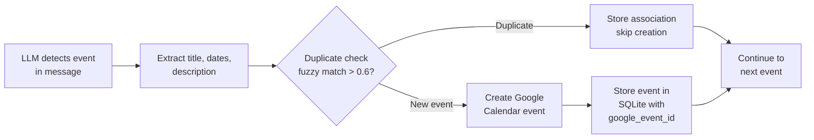
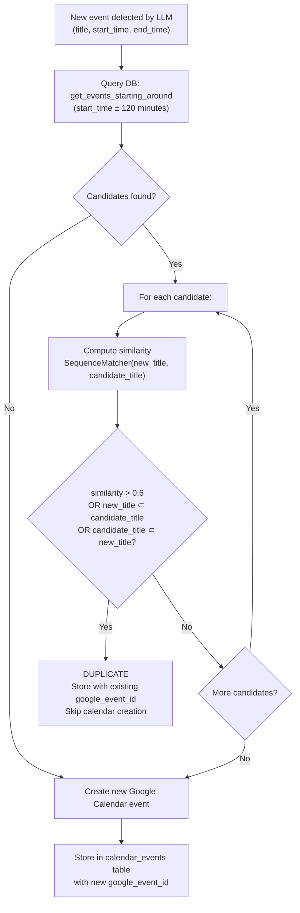
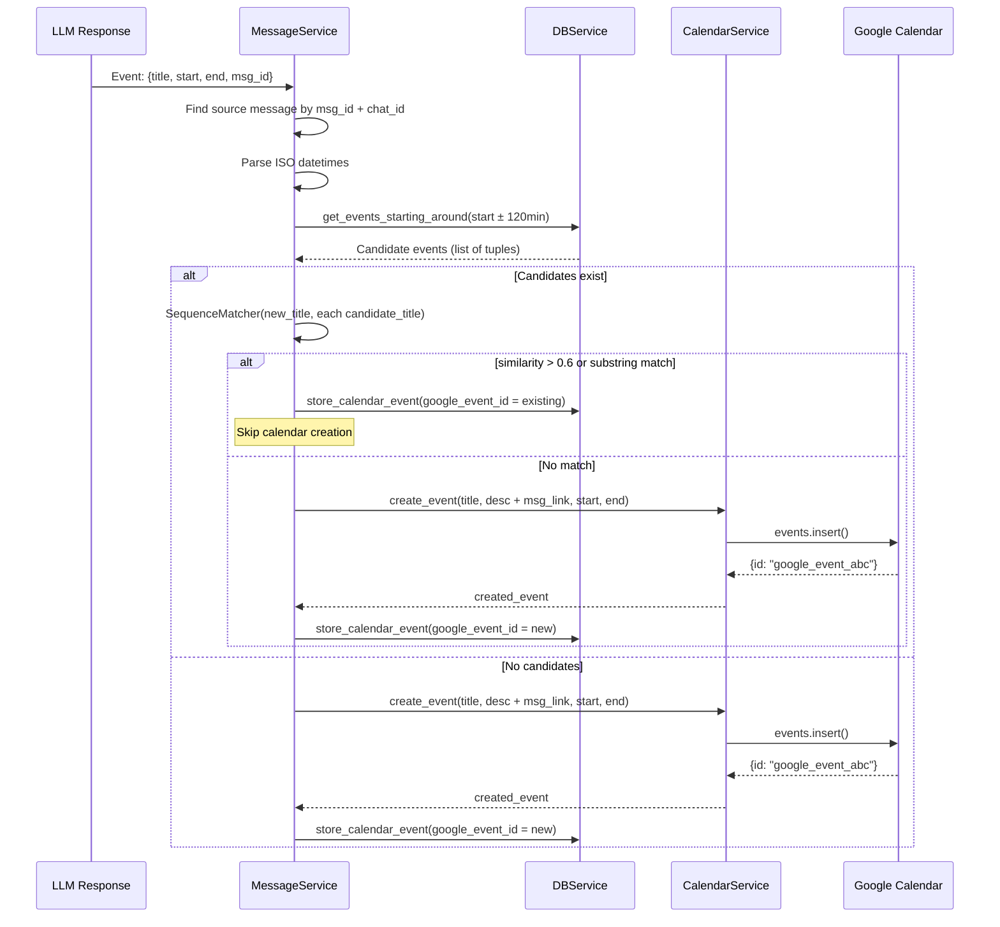

# Design: Calendar Integration & Event Deduplication

> **Status**: Approved
> **Author**: Design Architect Agent
> **Date**: March 28, 2026
> **Scope**: `service/calendarService.py`, event handling in `service/messageService.py`
> **See also**: [System Overview](system-overview.design.md) · [Data Model](data-model.design.md) · [LLM Integration](llm-integration.design.md)

---

## 1. Overview

The system automatically detects event-like information in Telegram messages (via LLM analysis) and creates Google Calendar entries. A fuzzy deduplication algorithm prevents the same real-world event from being created multiple times when mentioned in different messages.

---

## 2. `service/calendarService.py` — Google Calendar Integration

| Aspect          | Detail                                                              |
|-----------------|---------------------------------------------------------------------|
| **Purpose**     | Creates and manages Google Calendar events via service account      |
| **Auth**        | Service account credentials from `service_account_creds.json`      |
| **Scopes**      | `https://www.googleapis.com/auth/calendar`                         |
| **Key Methods** | `create_event()`, `get_subscription_link()`, `clear_all_events()`  |

### Methods

**`create_event(name, description, start_datetime, end_datetime)`**
- Creates a Google Calendar event with the given title, description, and time range.
- The description includes the original Telegram message link (appended by the caller).
- Returns the created event object (including `id` for the `google_event_id`).

**`get_subscription_link()`**
- Returns a Google Calendar subscription URL for the configured calendar.

**`clear_all_events()`**
- Deletes all events from the calendar. Intended for manual use only.

---

## 3. Use Case: Automatic Calendar Event Extraction

**Actor**: System (triggered during message analysis)

**Preconditions**:
- Google Calendar service account is configured
- Calendar ID is set in environment
- LLM prompt instructs the model to detect events

**Main Flow**:
1. During message analysis, the LLM identifies events with `title`, `start_datetime`, `end_datetime`, and `description`.
2. For each detected event, the system queries SQLite for existing events within a ±2 hour window of the start time.
3. System performs fuzzy title matching using `SequenceMatcher` (threshold: 0.6) and substring containment checks.
4. If a duplicate is detected, the system stores the association (linking the new message to the existing Google event) but does **not** create a new calendar entry.
5. If the event is new, the system creates a Google Calendar event (with a Telegram message link in the description) and stores it in SQLite with the returned `google_event_id`.

**Postconditions**:
- New unique events appear in Google Calendar.
- Duplicate events are tracked but not duplicated in the calendar.
- All events are recorded in the `calendar_events` table.

---

## 4. Event Deduplication Algorithm

### Algorithm Details

The deduplication runs in `MessageService.handle_events()` (and the equivalent inline block in `process_dialogs()`):

1. **Time window query** — `DBService.get_events_starting_around(start_time, window_minutes=120)` returns all stored events whose `start_time` falls within ±2 hours of the new event's start time.

2. **Fuzzy title matching** — For each candidate:
   - Compute `difflib.SequenceMatcher(None, new_title, candidate_title).ratio()`
   - If `ratio > 0.6` → duplicate
   - If `new_title in candidate_title` or `candidate_title in new_title` → duplicate (substring containment)

3. **Duplicate handling** — The event record is still stored in `calendar_events`, but with the **existing** `google_event_id` (linking to the already-created calendar event). No new Google Calendar event is created.

4. **New event handling** — `CalendarService.create_event()` is called. The `google_event_id` from the response is stored in `calendar_events`.

### Candidate Tuple Structure

The `get_events_starting_around()` query returns raw tuples from SQLite:

| Index | Column           |
|-------|------------------|
| 0     | `id`             |
| 1     | `dialog_id`      |
| 2     | `event_id`       |
| 3     | `google_event_id` |
| 4     | `title`          |
| 5     | `start_time`     |
| 6     | `end_time`       |
| 7     | `description`    |
| 8     | `created_at`     |

The algorithm uses index `[4]` for title and `[3]` for `google_event_id`.

### Test Coverage

`verify_deduplication.py` provides standalone test cases for the dedup logic:
- "Team Dinner" vs "Team Dinner with Bob" — expects duplicate (substring match)
- "Dinner" vs "Dinner with Bob" — expects duplicate (substring match)

---

## 5. Event Data Flow Through the System

---

<small>Generated by Design Architect agent with GitHub Copilot</small>
