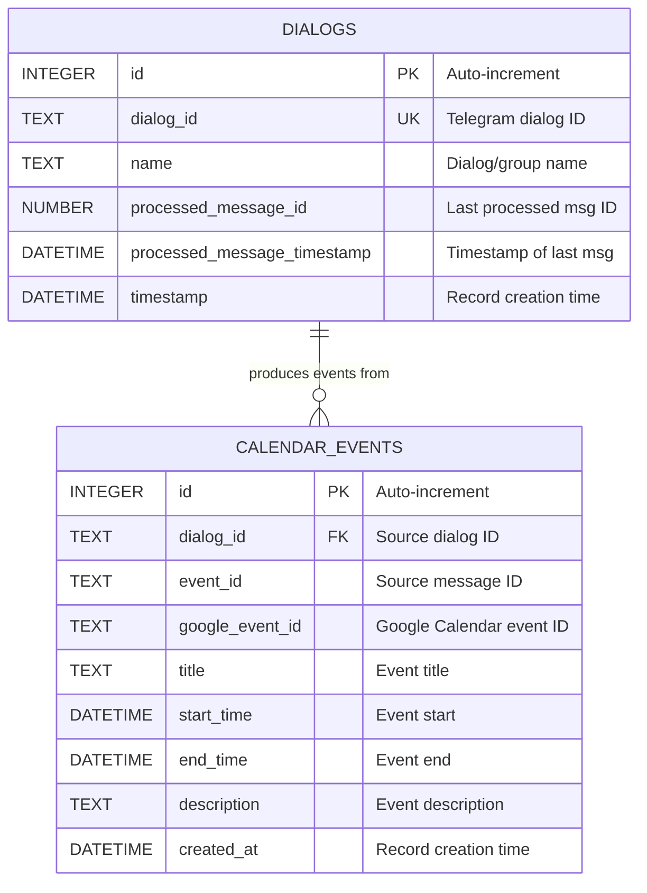

# Design: Data Model & Persistence

> **Status**: Approved
> **Author**: Design Architect Agent
> **Date**: March 28, 2026
> **Scope**: `service/dbService.py`, SQLite schema (`messages.db`)
> **See also**: [System Overview](system-overview.design.md) · [Calendar & Deduplication](calendar-deduplication.design.md)

---

## 1. Overview

The system uses a file-based SQLite database (`messages.db`) to track two concerns:
- **Dialog processing state** — Which messages have been processed per Telegram dialog (cursor tracking).
- **Calendar event history** — All detected events, including deduplication associations.

---

## 2. Entity Relationship Diagram

---

## 3. Table Details

### 3.1 `dialogs` — Processing State Tracker

Tracks the last-processed message per Telegram dialog to implement cursor-based fetching.

| Column                       | Type     | Constraints              | Purpose                          |
|------------------------------|----------|--------------------------|----------------------------------|
| `id`                         | INTEGER  | PRIMARY KEY AUTOINCREMENT | Internal row ID                  |
| `dialog_id`                  | TEXT     | NOT NULL, UNIQUE         | Telegram dialog/chat ID          |
| `name`                       | TEXT     | NOT NULL                 | Dialog/group name (for display)  |
| `processed_message_id`       | NUMBER   |                          | ID of the last processed message |
| `processed_message_timestamp` | DATETIME |                          | Timestamp of the last processed message |
| `timestamp`                  | DATETIME | DEFAULT CURRENT_TIMESTAMP | Record creation time             |

**Behavior**:
- `dialog_id` + `processed_message_id` form the cursor: on each run, only messages with `id > processed_message_id` are fetched.
- `UNIQUE(dialog_id)` prevents duplicate entries.
- Rows are created via `store_dialog_name()` (INSERT OR IGNORE) and updated via `update_last_processed_message()`.

### 3.2 `calendar_events` — Event History

Stores all detected events, both newly created and deduplicated associations.

| Column           | Type     | Constraints                       | Purpose                              |
|------------------|----------|-----------------------------------|--------------------------------------|
| `id`             | INTEGER  | PRIMARY KEY AUTOINCREMENT         | Internal row ID                      |
| `dialog_id`      | TEXT     | NOT NULL                          | Source Telegram dialog ID            |
| `event_id`       | TEXT     | NOT NULL                          | Source Telegram message ID           |
| `google_event_id` | TEXT    |                                   | Google Calendar event ID             |
| `title`          | TEXT     | NOT NULL                          | Event title                          |
| `start_time`     | DATETIME | NOT NULL                          | Event start time                     |
| `end_time`       | DATETIME | NOT NULL                          | Event end time                       |
| `description`    | TEXT     |                                   | Event description                    |
| `created_at`     | DATETIME | DEFAULT CURRENT_TIMESTAMP         | Record creation time                 |

**Constraints**: `UNIQUE(dialog_id, event_id)` — prevents the same message from generating duplicate event records.

**Behavior**:
- `google_event_id` links to the actual Google Calendar event.
- For deduplicated events, `google_event_id` references another record's Google event (the original).
- Used for fuzzy deduplication: `get_events_starting_around()` queries this table.
- Uses `INSERT OR REPLACE` to handle re-processing of the same message.

> **Migration note**: The `google_event_id` column is added via `ALTER TABLE` if it doesn't already exist, for backward compatibility with older databases.

---

## 4. `service/dbService.py` — Persistence Layer

| Aspect          | Detail                                                              |
|-----------------|---------------------------------------------------------------------|
| **Purpose**     | SQLite operations for tracking dialogs and calendar events          |
| **DB File**     | `messages.db` (configurable via constructor)                        |
| **Connection**  | Short-lived connections per operation (context manager pattern)     |

### Methods

| Method | Parameters | Returns | Purpose |
|--------|-----------|---------|---------|
| `_create_tables()` | — | — | Creates both tables if they don't exist; runs `google_event_id` migration |
| `store_dialog_name(dialog_id, name)` | `str, str` | `None` | INSERT OR IGNORE a dialog record |
| `get_last_processed_message(dialog_id)` | `str` | `Optional[int]` | Returns the last processed message ID, or `None` |
| `update_last_processed_message(dialog_id, message_id, message_time)` | `str, int, datetime` | `None` | Updates the cursor for a dialog |
| `store_calendar_event(dialog_id, event_id, title, start_time, end_time, description, google_event_id)` | `str, str, str, datetime, datetime, Optional[str], Optional[str]` | `None` | INSERT OR REPLACE a calendar event record |
| `get_events_starting_around(start_time, window_minutes)` | `datetime, int` | `List[Tuple]` | Returns events with `start_time` within ±`window_minutes` |
| `get_events_by_time_range(start_time, end_time, delta_minutes)` | `datetime, datetime, int` | `List[Tuple]` | Returns events within a time range ± delta |

### Connection Pattern

Each method opens a new `sqlite3.connect()` via context manager and commits within it. This is safe for single-threaded batch execution but would need connection pooling for concurrent access.

---

<small>Generated by Design Architect agent with GitHub Copilot</small>
