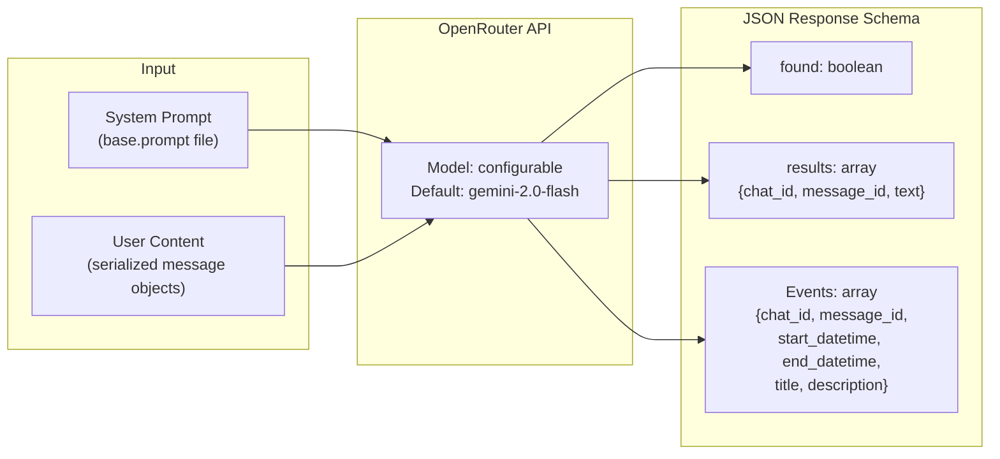
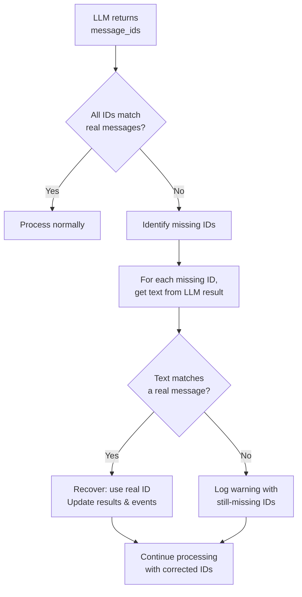

# Design: LLM Integration

> **Status**: Approved
> **Author**: Design Architect Agent
> **Date**: March 28, 2026
> **Scope**: `service/textAnalyzer.py`, hallucination recovery in `service/messageService.py`
> **See also**: [System Overview](system-overview.design.md) · [Message Processing](message-processing.design.md)

---

## 1. Overview

The system uses an LLM (via OpenRouter) to analyze batches of Telegram messages against a user-defined prompt. The LLM returns structured JSON identifying relevant messages and detected calendar events. The integration includes retry logic, structured output enforcement, and hallucination recovery.

---

## 2. `service/textAnalyzer.py` — LLM Service

| Aspect          | Detail                                                              |
|-----------------|---------------------------------------------------------------------|
| **Purpose**     | Sends messages to an LLM via OpenRouter for structured analysis     |
| **Provider**    | OpenRouter (`https://openrouter.ai/api/v1`) via OpenAI SDK         |
| **Default Model** | `google/gemini-2.0-flash-exp:free` (configurable via `LLM_MODEL` env var) |
| **Temperature** | `0` (deterministic output)                                         |
| **Retry**       | 10 attempts, 30s wait between each (Tenacity)                      |

### Key Methods

- **`findMessages(text)`** — Public entry point. Sends serialized message objects to the LLM, parses the structured JSON response. Returns `{"results": [...], "Events": [...]}` if matches are found, or `None` if `found` is `false`.
- **`__generate_content_with_retry()`** — Internal retry-wrapped method that calls `client.chat.completions.create()` with the JSON schema.
- **`__clean_json_content(content)`** — Strips markdown code fences (` ```json `, ` ``` `) from LLM responses that wrap JSON in code blocks.

---

## 3. Request/Response Schema



### 3.1 Message Object Format (sent to LLM)

Each message is serialized as a Python dict with these fields:

```json
{
    "chat_title": "Group Name",
    "chat_id": 123456789,
    "text": "Message content\nPoll question if applicable",
    "message_id": 42,
    "datetime": "2026-03-28T14:30:00+02:00"
}
```

The datetime is converted to `Europe/Madrid` timezone by `Util.construct_message_object()`.

### 3.2 LLM Response Schema (enforced via `json_schema` response format)

```json
{
    "found": true,
    "results": [
        {
            "chat_id": "123456789",
            "message_id": "42",
            "text": "Matched message text"
        }
    ],
    "Events": [
        {
            "chat_id": "123456789",
            "message_id": "42",
            "start_datetime": "2026-04-01T18:00:00",
            "end_datetime": "2026-04-01T20:00:00",
            "title": "Team Dinner",
            "description": "Quarterly team dinner at restaurant"
        }
    ]
}
```

The schema is enforced via `response_format={"type": "json_schema", "json_schema": ...}` with `strict: true` and `additionalProperties: false` on all objects. All values in the schema are **strings** (including `chat_id` and `message_id`).

---

## 4. LLM ID Hallucination Recovery

A key resilience feature: the LLM sometimes returns `message_id` values that don't correspond to real messages (hallucinations). The system recovers via text-content fallback matching.



### Recovery Algorithm (in `MessageService.process_dialogs()`)

1. After LLM analysis, cross-reference returned `message_id` values against actual fetched messages.
2. If `len(messages_found) < messages_found_count` → some IDs are hallucinated.
3. For each missing ID:
   a. Find the corresponding LLM result object to get its `text` field.
   b. Search all fetched messages for an exact text match (via `Util.construct_message_text()`).
   c. If found, update the result's `message_id` to the real ID.
   d. Also update any linked events that reference the hallucinated ID.
4. Send an info message to the error channel listing recovered messages.
5. If some IDs **still** don't match after recovery, send a warning to the error channel.

### Why This Works

The LLM reliably returns the correct **text content** of matched messages even when it fabricates IDs. By matching on text content, the system can recover the vast majority of valid results.

---

<small>Generated by Design Architect agent with GitHub Copilot</small>
