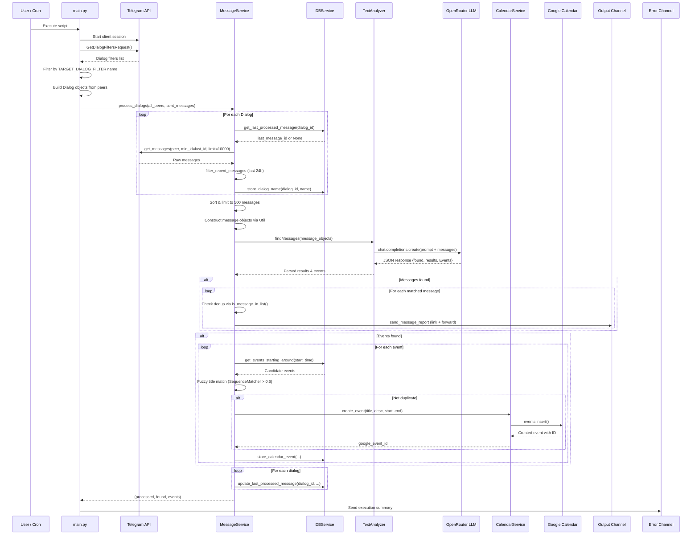
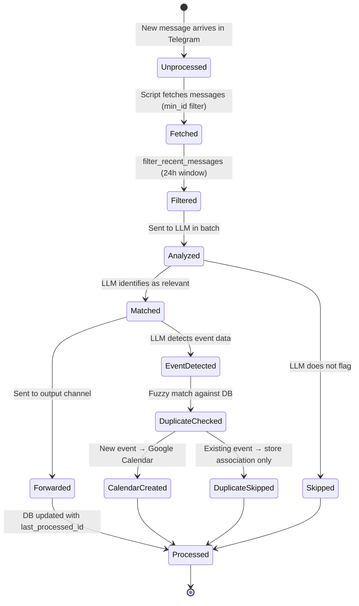
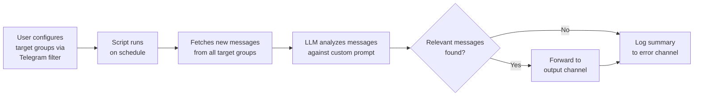
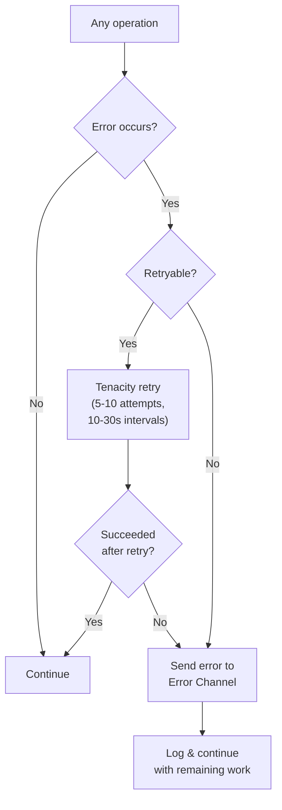

# Design: Message Processing Pipeline

> **Status**: Approved
> **Author**: Design Architect Agent
> **Date**: March 28, 2026
> **Scope**: `main.py`, `service/messageService.py`, `service/util.py`
> **See also**: [System Overview](system-overview.design.md) · [LLM Integration](llm-integration.design.md) · [Calendar & Deduplication](calendar-deduplication.design.md)

---

## 1. Overview

The system operates as a **batch-processing pipeline** that runs on-demand (or via cron). Each execution:

1. Authenticates with Telegram and initializes all services.
2. Reads the user's Telegram dialog filters to identify target groups/channels.
3. Fetches unprocessed messages (since last run) from all target dialogs.
4. Sends the batch of messages to an LLM for analysis against a user-defined prompt.
5. Forwards matched messages to a Telegram output channel.
6. Creates Google Calendar events for detected events (with fuzzy deduplication).
7. Updates the SQLite database with processing state.
8. Reports execution summary (and any errors) to a Telegram error channel.

---

## 2. Data Flow — Main Execution Pipeline



---

## 3. Component Details

### 3.1 `main.py` — Orchestrator

| Aspect              | Detail                                                                                                         |
|---------------------|----------------------------------------------------------------------------------------------------------------|
| **Purpose**         | Entry point; wires all services together and runs the pipeline                                                  |
| **Responsibilities** | Initialize Telegram client, load env, fetch dialog filters, delegate to `MessageService`, report summary       |
| **Key Functions**   | `main()`, `get_dialog_filters_with_retry()`, `build_dialog_object()`, `get_target_dialog_objects()`            |

**`get_dialog_filters_with_retry()`** — Fetches dialog filters from Telegram with 5 retry attempts (10s wait). Maps the `TARGET_DIALOG_FILTER` env var to a specific filter by name.

**`build_dialog_object(peer)`** — Converts Telethon peer types (`InputPeerChannel`, `InputPeerChat`, `InputPeerUser`) into the internal `Dialog` model.

**`get_target_dialog_objects(filters, env)`** — Finds the dialog filter matching `env.target_dialog_filter` by title and returns `Dialog` objects for all its `include_peers`. Filters out `None` for unrecognized peer types.

### 3.2 `service/messageService.py` — Core Processing Engine

| Aspect          | Detail                                                              |
|-----------------|---------------------------------------------------------------------|
| **Purpose**     | Orchestrates the full message processing pipeline                   |
| **Key Methods** | `process_dialogs()`, `process_dialog()`, `handle_found_messages()`, `handle_events()`, `get_messages_with_retry()`, `filter_recent_messages()` |
| **Resilience**  | LLM ID hallucination recovery via text-content fallback matching; fuzzy event deduplication |

#### `process_dialogs(dialog_objects, sent_messages)` — Batch Mode

The primary entry point used by `main.py`. Processes **all dialogs at once**:

1. For each dialog, fetches messages since `last_processed_message_id`, filtered to last 24 hours.
2. Aggregates all messages across dialogs, sorted by date (newest first).
3. Limits to **500 messages** (takes the oldest 500 for contiguous processing).
4. Constructs message objects via `Util.construct_message_object()`.
5. Sends the entire batch to the LLM via `TextAnalyzer.findMessages()`.
6. Performs **LLM ID hallucination recovery** (see [LLM Integration](llm-integration.design.md)).
7. Forwards matched messages and handles detected events.
8. Updates `last_processed_message` for each dialog.

#### `process_dialog(dialog_object, sent_messages)` — Single Dialog Mode

An alternative entry point that processes one dialog at a time. Same logic but scoped to a single dialog. Not used in the current `main.py` pipeline (which uses `process_dialogs` instead).

#### `handle_found_messages(messages, message_ids, sent_messages, dialog_name)`

For each matched message ID:
1. Checks dedup via `Util.is_message_in_list()` against `sent_messages`.
2. Sends a report via `Util.send_message_report()` (link + forwarded message).
3. Appends to `sent_messages` to prevent re-forwarding within the same run.

#### `handle_events(messages, events, dialog_name, dialog_id)`

See [Calendar & Deduplication](calendar-deduplication.design.md) for full details.

### 3.3 `service/util.py` — Utility Functions

| Aspect          | Detail                                                              |
|-----------------|---------------------------------------------------------------------|
| **Purpose**     | Static helpers for message formatting, link generation, dedup       |
| **Key Methods** | `get_message_link()`, `send_message_report()`, `construct_message_object()`, `construct_message_text()`, `is_message_in_list()`, `get_poll_question_text()` |

#### `get_message_link(message)`

Generates a Telegram link to the original message:
- Public channels with username: `https://t.me/{username}/{id}`
- Private channels/groups: `https://t.me/c/{chat_id}/{id}`
- Plain chats (no link support): `From chat: {title}`

#### `send_message_report(client, message, output_dialog_id)`

Sends two messages to the output channel with **staggered scheduling** so they appear as unread:
1. Message link (scheduled at `60 + offset * 60` seconds)
2. Forwarded original message (scheduled at `90 + offset * 60` seconds)

Uses a class-level `_offset` counter that increments per message to space out deliveries.

#### `construct_message_object(message, timezone_name)`

Serializes a Telethon `Message` into a dict for LLM consumption:
```json
{
    "chat_title": "Group Name",
    "chat_id": 123456789,
    "text": "Message content\nPoll question if applicable",
    "message_id": 42,
    "datetime": "2026-03-28T14:30:00+02:00"
}
```

Datetime is converted to a configurable timezone (defaults to `Europe/Madrid`, overridable via `TIMEZONE` env var). Callers in `MessageService` pass `self.env.timezone`.

#### `is_message_in_list(str1, str_list)`

Fuzzy dedup for forwarded messages: compares strings after stripping newlines, non-alpha characters, and lowercasing. Returns `True` if `str1` matches any string in the list.

#### `get_poll_question_text(message)`

Safely extracts poll question text from `message.media.poll.question.text`, returning empty string if any attribute is missing.

---

## 4. Message Processing State Machine



---

## 5. Use Case: Automated Message Monitoring & Forwarding



**Actor**: User (or automated scheduler / cron)

**Preconditions**:
- Telegram client is authenticated
- Target dialog filter exists with groups/channels
- `base.prompt` defines the analysis criteria
- Output and error Telegram channels are accessible

**Main Flow**:
1. User executes `python main.py` (manually or via cron).
2. System authenticates with Telegram and fetches dialog filters.
3. System identifies all dialogs matching `TARGET_DIALOG_FILTER`.
4. For each dialog, system fetches messages since last processed ID, filtered to the last 24 hours.
5. All messages (up to 500) are sent to the LLM with the system prompt from `base.prompt`.
6. LLM returns structured JSON identifying matching messages.
7. For each match, system forwards the original message + link to the output channel.
8. System updates the database with the latest processed message ID.
9. System sends an execution summary to the error channel.

**Postconditions**:
- Relevant messages are in the output channel.
- Database reflects current processing state.

**Error Flows**:
- If LLM hallucinates message IDs, the system attempts text-content fallback recovery.
- If message forwarding fails, errors are reported to the error channel.
- If API calls fail, Tenacity retries up to 5-10 times with fixed waits.

---

## 6. Error Handling & Resilience



**Retry policies**:

| Operation                        | Max Attempts | Wait Between |
|----------------------------------|-------------|--------------|
| Telegram: fetch dialog filters   | 5           | 10 seconds   |
| Telegram: fetch messages         | 5           | 10 seconds   |
| LLM: analyze messages            | 10          | 30 seconds   |

**Error channel receives**:
- Calendar Service initialization failures
- Message processing errors (per message)
- LLM analysis failures (per batch)
- Event creation failures (per event)
- ID mismatch warnings
- Execution summaries (always, even on success)

---

<small>Generated by Design Architect agent with GitHub Copilot</small>
