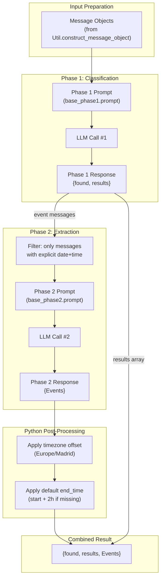
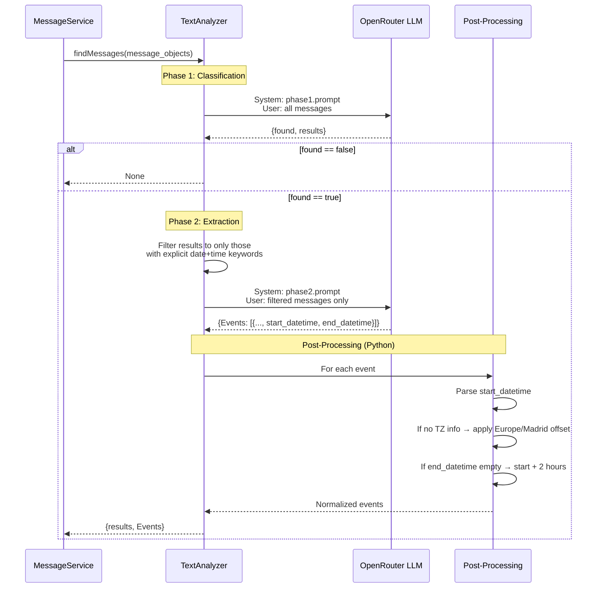

# Design: Prompt Optimization for Free-Tier LLMs

> **Status**: Implemented
> **Author**: Design Architect Agent
> **Date**: March 29, 2026
> **Scope**: `base.prompt`, `service/textAnalyzer.py`, `service/messageService.py`, `service/util.py`
> **See also**: [LLM Integration](llm-integration.design.md) · [Message Processing](message-processing.design.md) · [System Overview](system-overview.design.md)

---

## 1. Problem Statement

The current `base.prompt` was written for high-capability models but the system runs on **OpenRouter free-tier models** (e.g., `google/gemini-2.0-flash-exp:free`). The prompt has several issues that hurt reliability on weaker models:

- **~3,600 characters** of interleaved rules, schemas, timezone math, and examples overload context
- JSON output format is described in prose despite being **already enforced by code** via `json_schema` response format
- The LLM is asked to perform **timezone offset math** (incl. DST rules) and **end-time arithmetic** — tasks better done in Python
- Subjective criteria ("very high confidence") produce inconsistent outcomes on weaker models
- Russian-only output for titles/descriptions stresses multilingual capability on free-tier models
- The `source` field is sent in input but never referenced by the prompt
- The single-call approach asks the model to do two different tasks simultaneously (classify + extract structured datetime data)

---

## 2. Project Context

### 2.1 Tech Stack
- Python 3.10+, OpenAI SDK via OpenRouter, Telethon, WAHA, SQLite, Google Calendar API
- Default model: `google/gemini-2.0-flash-exp:free` (configurable via `LLM_MODEL` env var)
- `response_format` with `json_schema` and `strict: true` enforces output shape in code

### 2.2 Architecture Patterns
- `TextAnalyzer.findMessages(text)` is the single LLM call point — takes serialized message dicts, returns parsed JSON
- `MessageService.process_sources()` is the caller — handles hallucination recovery, event dedup, calendar creation
- `Util.construct_message_object()` serializes `UnifiedMessage` → dict for LLM input (includes `source` field)
- Timestamps are already converted to Europe/Madrid timezone in Python **before** being sent to the LLM

### 2.3 Current Prompt Structure (base.prompt)
1. Task description (~100 tokens)
2. Definitions for `results` vs `Events` (~120 tokens)
3. Rules for `results` (~60 tokens)
4. Rules for `Events` (~150 tokens)
5. Vague-time exclusion list (~100 tokens)
6. End-time calculation rules (~80 tokens)
7. Timezone rules (~80 tokens)
8. **Output format** with full JSON template (~200 tokens) — **redundant with code schema**
9. Additional requirements incl. Russian output (~60 tokens)
10. Ignore examples (~80 tokens)
11. Full 4-message few-shot example (~400 tokens)

**Total: ~1,430 tokens** (prompt only, excluding input messages)

---

## 3. Proposed Design

### 3.1 Overview

Five changes, applied together:

| # | Change | Category |
|---|--------|----------|
| A | **Two-phase LLM approach** — Split the single call into Phase 1 (classify) and Phase 2 (extract) | Architecture |
| B | **Move timezone & end-time math to Python** — LLM returns raw time strings; post-processing handles offsets and defaults | Offload computation |
| C | **Use source language** for titles/descriptions — Remove Russian-only requirement | Simplify LLM task |
| D | **Reference the `source` field** — Acknowledge it in the prompt so the model doesn't treat it as noise | Input clarity |
| E | **Strip redundant format instructions + restructure prompt** — Remove JSON template, use numbered flat rules, shorten examples | Token efficiency |

### 3.2 Component Diagram



### 3.3 Data Flow — Two-Phase Processing



### 3.4 Phase 1 — Classification Prompt Design

**Goal**: Identify which messages describe real-world events/gatherings. Simple yes/no per message.

**Key changes from current prompt**:
- Task is reduced to classification only — no datetime extraction
- `source` field is acknowledged ("Messages come from `source` (telegram or whatsapp)")
- Numbered flat rules replace prose paragraphs
- No output format block (enforced by schema)
- Shorter 2-message example instead of 4

**Phase 1 JSON Schema** (new, simpler):
```json
{
  "found": "boolean",
  "results": [
    {
      "chat_id": "string",
      "message_id": "string",
      "text": "string",
      "has_explicit_datetime": "boolean"
    }
  ]
}
```

The new `has_explicit_datetime` field is a lightweight hint from Phase 1: "does this message contain an explicit date AND clock time?" This is used to filter which messages go to Phase 2. The LLM only has to make a binary judgment, not extract the actual datetime.

### 3.5 Phase 2 — Event Extraction Prompt Design

**Goal**: For a small subset of already-classified messages, extract event title, description, and raw start/end time strings.

**Key changes from current prompt**:
- Receives only messages that Phase 1 flagged with `has_explicit_datetime: true`
- Much smaller input → better focus
- No timezone math — LLM returns times **as written in the message** plus the date resolved from context
- No end-time arithmetic — if end time isn't in the message, LLM returns empty string
- Titles/descriptions in the **source language** of the message (not forced Russian)
- `source` field is present for context

**Phase 2 JSON Schema** (new):
```json
{
  "Events": [
    {
      "chat_id": "string",
      "message_id": "string",
      "title": "string",
      "description": "string",
      "start_datetime": "string",
      "end_datetime": "string"
    }
  ]
}
```

Where:
- `start_datetime` — resolved date + explicit time, in format `YYYY-MM-DDTHH:MM` (no timezone, no offset)
- `end_datetime` — same format if explicitly mentioned, or **empty string** `""` if not mentioned
- `title` / `description` — in the language of the original message

### 3.6 Python Post-Processing (new)

After Phase 2 returns, `TextAnalyzer` (or a new helper) applies:

1. **Timezone**: Parse `start_datetime` as naive → localize to `Europe/Madrid` (using `ZoneInfo`) → convert to ISO 8601 with offset
2. **Default end time**: If `end_datetime` is empty → `start_datetime + timedelta(hours=2)`
3. **End time timezone**: Same localization as start

This replaces the current prompt sections "End Time Rules" and "Timezone Rules" entirely.

### 3.7 `source` Field Usage

The `source` field is already sent in the message objects by `Util.construct_message_object()`. Both prompts will reference it:

- Phase 1: "Each message has a `source` field (`telegram` or `whatsapp`) indicating its platform."
- Phase 2: Same acknowledgment — no behavioral change, but it prevents the model from treating it as unexpected noise.

No code changes needed in `Util.construct_message_object()` — the field is already present.

---

## 4. Decision Log

| # | Decision | Options Considered | Chosen | Rationale |
|---|----------|-------------------|--------|-----------|
| 1 | Two-phase LLM calls | A: Single call (current), B: Two-phase | B | User requested. Simpler tasks per call → higher accuracy on free-tier models. Phase 2 only runs on a small subset. |
| 2 | Move TZ/end-time math to Python | A: Keep in prompt, B: Move to Python | B | User approved. Eliminates DST reasoning from LLM. Deterministic in code. |
| 3 | Output language | A: Force Russian, B: Source language | B | User requested. Reduces multilingual stress on free-tier models. |
| 4 | `source` field handling | A: Strip from input, B: Reference in prompt | B | User chose to use it. Mentioning it prevents confusion. |
| 5 | Phase 1 datetime hint | A: Phase 2 gets all results, B: Phase 1 provides `has_explicit_datetime` flag to filter | B | Pre-filtering reduces Phase 2 input size and cost. Simple boolean is trivial for the model. |

---

## 5. Impact Analysis

### 5.1 Breaking Changes

- **Prompt files**: `base.prompt` is replaced by `base_phase1.prompt` and `base_phase2.prompt`. The `BASE_PROMPT_FILE` env var will need updating (or the code can auto-discover both files from a single directory).
- **Calendar event titles**: Will now be in the source language instead of Russian. Existing calendar entries are unaffected.
- **`TextAnalyzer` API**: `findMessages()` return shape stays the same (`{results, Events}`) — callers are unaffected.
- **`RESPONSE_SCHEMA`**: Splits into two schemas (Phase 1 and Phase 2). Internal to `TextAnalyzer`.

### 5.2 Security Considerations

No new attack surface. Prompt injection risk is unchanged (user messages are passed as LLM input — same as before).

### 5.3 Performance Considerations

| Metric | Before | After |
|--------|--------|-------|
| LLM calls per run | 1 | 1–2 (Phase 2 skipped if no events) |
| Prompt tokens (Phase 1) | ~1,430 | ~600 |
| Prompt tokens (Phase 2) | — | ~400 (only when events exist) |
| Input tokens (Phase 2) | — | Much smaller (only event messages, not all 500) |
| Total cost | 1 call × full prompt | Comparable or cheaper — Phase 2 input is tiny |
| Accuracy | Baseline | Higher — each call has a focused, simpler task |

On **free-tier models**, Phase 2 costing an extra call is not a cost concern — it's free. The reliability improvement is the primary gain.

### 5.4 Testing Strategy

- Manually run with the existing message corpus and compare output quality vs. current single-prompt approach
- Verify post-processing: naive datetime → Madrid TZ → ISO 8601 with correct offset (test DST boundaries)
- Verify empty `end_datetime` → `start + 2h` in Python
- Verify hallucination recovery still works (unchanged logic in `MessageService`)

---

## 6. Risks & Open Questions

| # | Risk/Question | Severity | Mitigation/Answer |
|---|---------------|----------|-------------------|
| 1 | Phase 1 `has_explicit_datetime` flag may have false negatives (model says false but datetime is present) | Medium | Phase 2 only skips messages flagged false. Worst case: event goes to `results` but not `Events` — same as today when the model is unsure. |
| 2 | Two calls doubles latency | Low | Phase 2 only runs when events are found. Free-tier latency is already variable. Net accuracy improvement outweighs. |
| 3 | LLM returns date in unexpected format (not `YYYY-MM-DDTHH:MM`) | Medium | Post-processing should attempt `dateutil.parser.parse()` as fallback, with a log warning. |
| 4 | `BASE_PROMPT_FILE` env var now needs to point to two files | Low | Options: (a) new env vars `PHASE1_PROMPT_FILE` / `PHASE2_PROMPT_FILE`, (b) single dir path, (c) keep `BASE_PROMPT_FILE` as Phase 1 and add `PHASE2_PROMPT_FILE`. Option (c) minimizes env change. |

---
<small>Generated by Design Architect agent with GitHub Copilot</small>
