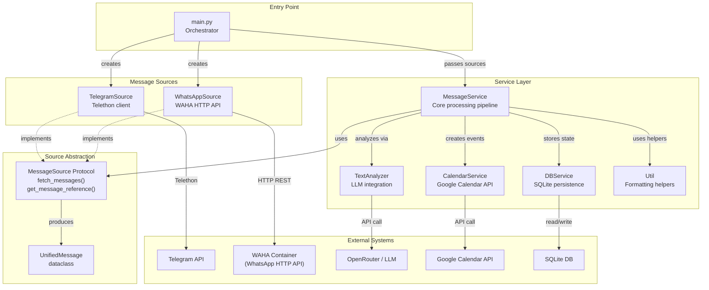
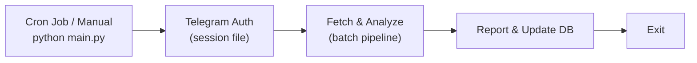

# Design: System Overview & Architecture

> **Status**: Approved
> **Author**: Design Architect Agent
> **Date**: March 28, 2026
> **Scope**: Full system — `main.py`, `model/`, `service/`, `source/`
> **See also**: [Message Processing](message-processing.design.md) · [LLM Integration](llm-integration.design.md) · [Calendar & Deduplication](calendar-deduplication.design.md) · [Data Model](data-model.design.md) · [WhatsApp Integration](whatsapp-waha-integration.design.md)

---

## 1. Problem Statement

Users participating in multiple Telegram groups and channels need an automated way to:

1. **Monitor and filter messages** — Scan high-volume **Telegram and WhatsApp** chats for messages matching specific user-defined criteria (e.g., relevant announcements, action items, keywords).
2. **Extract calendar events** — Automatically detect event-like messages (with dates, times, titles) and create corresponding Google Calendar entries, avoiding duplicates.
3. **Consolidate reporting** — Send formatted reports of relevant messages to a dedicated Telegram output channel so the user has a single aggregated feed of important information.

Without this system, users must manually read through hundreds of messages daily across many groups, risking missed events and information overload.

---

## 2. Tech Stack

| Component        | Technology                                                                                              |
|------------------|---------------------------------------------------------------------------------------------------------|
| Language         | Python 3.10+                                                                                            |
| Telegram Client  | [Telethon](https://github.com/LonamiWebs/Telethon) 1.29.1                                              |
| LLM Integration  | [OpenAI SDK](https://github.com/openai/openai-python) 1.57.0 via [OpenRouter](https://openrouter.ai)   |
| Default LLM      | `google/gemini-2.0-flash-exp:free`                                                                      |
| Calendar         | Google Calendar API v3 (via service account) — requires `google-api-python-client`, `google-auth`       |
| Database         | SQLite 3 (file-based, `messages.db`)                                                                    |
| Retry Logic      | [Tenacity](https://github.com/jd/tenacity) 8.2.3                                                       |
| Env Management   | [python-dotenv](https://github.com/theskumar/python-dotenv) 1.0.0                                      |
| WhatsApp Client  | [WAHA (WhatsApp HTTP API)](https://waha.devlike.pro/) via `requests>=2.31.0`                             |
| HTTP Client      | [Requests](https://docs.python-requests.org/) 2.31.0+                                                   |

---

## 3. Architecture Patterns

- **Multi-source orchestrator** — `main.py` is the entry point; it initializes all services and message sources (`TelegramSource`, optionally `WhatsAppSource`), performs health checks, and delegates to `MessageService.process_sources()`.
- **Service-oriented modules** — Business logic is split into discrete service classes (`MessageService`, `TextAnalyzer`, `DBService`, `CalendarService`, `Util`).
- **Model layer** — Thin data classes (`UnifiedMessage`, `ChatInfo`, `EnvLoader`) for domain modeling and configuration. `Dialog`/`DialogType` are internal to `TelegramSource`.
- **Source abstraction** — A `MessageSource` protocol (`source/messageSource.py`) decouples message fetching from the processing pipeline, enabling multiple platform integrations.
- **Async/await** — The Telegram client and message processing pipeline use Python's `asyncio` (via Telethon's event loop).
- **Retry with backoff** — External API calls (Telegram, LLM) are wrapped with `@retry` decorators from Tenacity.
- **Structured LLM output** — The LLM is called with a JSON schema (`response_format`) to guarantee parseable structured responses.

---

## 4. Component Diagram

---

## 5. Integrations

| Integration         | Purpose                                      | Auth Mechanism                  |
|---------------------|----------------------------------------------|---------------------------------|
| Telegram API        | Read messages from groups/channels, send reports | API ID + Hash (user session)    |
| OpenRouter API      | Route LLM requests to chosen model           | API key (Bearer token)          |
| Google Calendar API | Create calendar events from detected events  | Service account JSON credentials |
| WAHA (WhatsApp HTTP API) | Fetch WhatsApp messages from labeled groups | API key (`X-Api-Key` header) |
| SQLite              | Track processing state and calendar events   | Local file, no auth             |

---

## 6. Component Summary

| Component                     | Purpose                                                         | Details In                                           |
|-------------------------------|-----------------------------------------------------------------|------------------------------------------------------|
| `main.py`                     | Entry point; initializes sources (Telegram, optionally WhatsApp), runs health checks, delegates to `MessageService.process_sources()` | [Message Processing](message-processing.design.md)   |
| `model/envLoader.py`          | Centralized access to all environment variables                 | §8 below                                             |
| `model/dialog.py` / `dialogType.py` | Wraps Telegram peer IDs into unified `Dialog` objects (internal to `TelegramSource`) | §8 below                                             |
| `model/unifiedMessage.py`     | Platform-agnostic message dataclass                            | [WhatsApp Integration](whatsapp-waha-integration.design.md) |
| `model/chatInfo.py`           | Platform-agnostic chat info dataclass                          | [WhatsApp Integration](whatsapp-waha-integration.design.md) |
| `source/messageSource.py`     | MessageSource protocol — abstraction for message fetching      | [WhatsApp Integration](whatsapp-waha-integration.design.md) |
| `source/telegramSource.py`    | Telegram source implementation (Telethon)                      | [WhatsApp Integration](whatsapp-waha-integration.design.md) |
| `source/whatsappSource.py`    | WhatsApp source implementation (WAHA HTTP API)                 | [WhatsApp Integration](whatsapp-waha-integration.design.md) |
| `service/messageService.py`   | Core message processing pipeline                               | [Message Processing](message-processing.design.md)   |
| `service/textAnalyzer.py`     | LLM integration via OpenRouter                                 | [LLM Integration](llm-integration.design.md)         |
| `service/dbService.py`        | SQLite persistence for dialogs and calendar events             | [Data Model](data-model.design.md)                   |
| `service/calendarService.py`  | Google Calendar event creation via service account             | [Calendar & Dedup](calendar-deduplication.design.md)  |
| `service/util.py`             | Message formatting, link generation, dedup helpers             | [Message Processing](message-processing.design.md)   |
| `tests/integration_tester.py` | Integration test system for prompt engineering and verification | [LLM Integration](llm-integration.design.md)         |

---

## 7. Deployment & Configuration

### 7.1 Environment Variables

| Variable               | Required | Description                                         |
|------------------------|----------|-----------------------------------------------------|
| `TELEGRAM_API_ID`      | Yes      | Telegram application API ID                         |
| `TELEGRAM_API_HASH`    | Yes      | Telegram application API hash                       |
| `OPENROUTER_API_KEY`   | Yes      | OpenRouter API key for LLM access                   |
| `LLM_MODEL`           | No       | LLM model identifier (default: `google/gemini-2.0-flash-exp:free`) |
| `BASE_PROMPT_FILE`     | Yes      | Path to the prompt file defining analysis criteria   |
| `TARGET_DIALOG_FILTER` | Yes      | Name of the Telegram folder/filter to monitor        |
| `OUTPUT_DIALOG_ID`     | Yes      | Telegram channel ID for forwarding matched messages  |
| `ERROR_DIALOG_ID`      | Yes      | Telegram channel ID for error/status reports         |
| `CALENDAR_ID`          | Yes      | Google Calendar ID for event creation                |
| `TIMEZONE`             | No       | Timezone for message datetime conversion (default: `Europe/Madrid`) |
| `WAHA_API_URL`         | No       | WAHA base URL (e.g., `http://localhost:3000`). If absent, WhatsApp is disabled. |
| `WAHA_API_KEY`         | Conditional | WAHA API key. Required if `WAHA_API_URL` is set. |
| `WAHA_SESSION`         | No       | WAHA session name (default: `default`) |
| `WHATSAPP_TARGET_LABEL` | Conditional | WhatsApp label name for chat selection. Required if `WAHA_API_URL` is set. |

> `EnvLoader` also exposes `PHONE_NUMBER` and `PASSWORD` properties but these are not actively used by the current pipeline.

### 7.2 File Dependencies

| File                            | Purpose                                    |
|---------------------------------|-------------------------------------------|
| `.env`                          | Environment variable definitions           |
| `base.prompt`                   | LLM system prompt defining analysis rules  |
| `service_account_creds.json`    | Google service account credentials         |
| `main.session` (auto-generated) | Telethon session file (Telegram auth state) |
| `messages.db` (auto-generated)  | SQLite database file                       |

### 7.3 Execution Model

The script is designed for **periodic batch execution** (e.g., every hour via cron). It is **not** a long-running daemon — it processes all pending messages and exits.

---

## 8. Model Layer Details

### 8.1 `model/envLoader.py` — Configuration

| Aspect         | Detail                                                                                                                                                                        |
|----------------|-------------------------------------------------------------------------------------------------------------------------------------------------------------------------------|
| **Purpose**    | Centralized access to all environment variables with startup validation                                                                                                                               |
| **Properties** | `telegram_api_id`, `telegram_api_hash`, `openrouter_api_key`, `llm_model`, `base_prompt` (cached, reads from file), `target_dialog_filter`, `output_dialog_id`, `error_dialog_id`, `calendar_id`, `timezone`, `waha_api_url`, `waha_api_key`, `waha_session`, `whatsapp_target_label`, `whatsapp_enabled` |
| **Validation** | `_validate()` checks all required env vars at startup and raises `EnvironmentError` if any are missing. `_validate_whatsapp()` checks WAHA-specific vars when `whatsapp_enabled` is True |

### 8.2 `model/dialog.py` / `model/dialogType.py` — Domain Models

| Aspect      | Detail                                                              |
|-------------|---------------------------------------------------------------------|
| **Purpose** | Wraps Telegram peer identifiers into a unified `Dialog` object      |
| **Types**   | `DialogType.CHAT`, `DialogType.CHANNEL`, `DialogType.USER`         |
| **Mapping** | `CHAT → PeerChat`, `CHANNEL → PeerChannel`, `USER → PeerUser`     |

---

## 9. Key Design Decisions

| # | Decision | Options Considered | Chosen | Rationale |
|---|----------|-------------------|--------|-----------|
| 1 | Batch vs. streaming processing | (A) Real-time event handler, (B) Periodic batch | B — Batch | Simpler architecture; avoids long-running process; LLM works better with context from multiple messages at once |
| 2 | Message analysis approach | (A) Regex/keyword matching, (B) LLM-based analysis | B — LLM | Flexible; user defines criteria in natural language via prompt file; handles nuance and context |
| 3 | LLM provider | (A) Direct Google AI, (B) OpenRouter proxy | B — OpenRouter | Model flexibility; can switch models via env var without code changes |
| 4 | Event deduplication | (A) Exact match only, (B) Fuzzy matching | B — Fuzzy (SequenceMatcher > 0.6 + substring) | Events from different messages may have slightly different wording for the same event |
| 5 | Calendar integration | (A) iCal file, (B) Google Calendar API | B — Google Calendar API | Real-time event creation; shared calendar support; subscription links |
| 6 | Database | (A) PostgreSQL, (B) SQLite | B — SQLite | Zero infrastructure; single-user system; portable file-based storage |
| 7 | LLM ID hallucination handling | (A) Discard unmatched, (B) Text fallback recovery | B — Text fallback | Recovers valid results even when LLM fabricates IDs; improves accuracy |
| 8 | Report output scheduling | (A) Immediate send, (B) Staggered schedule | B — Staggered (60s offsets) | Formatted reports appear as unread notifications (no forwarding) |
| 9 | Multi-source architecture | (A) Abstraction layer, (B) Parallel pipeline | A — Abstraction layer | Cleanest long-term architecture; avoids code duplication; enables future sources |

---

## 10. Risks & Limitations

| # | Risk/Limitation | Severity | Mitigation |
|---|----------------|----------|------------|
| 1 | LLM may hallucinate message IDs | Medium | Text-content fallback recovery implemented |
| 2 | LLM rate limits (OpenRouter/model) | Medium | Tenacity retry with 30s wait, up to 10 attempts |
| 3 | Telegram rate limits | Medium | Tenacity retry with 10s wait, up to 5 attempts |
| 4 | 500-message batch limit may miss messages | Low | Processes oldest first; next run picks up remainder |
| 5 | Fuzzy dedup threshold (0.6) may be too loose/tight | Low | Tunable; combined with substring check for safety |
| 6 | No unit test suite | Medium | `tests/integration_tester.py` provides end-to-end prompt verification; `verify_deduplication.py` exists as a standalone test; full unit test coverage not implemented |
| 7 | Single-threaded processing | Low | Adequate for personal use; batch size is bounded |
| 8 | SQLite single-writer limitation | Low | Single-user system; no concurrent writes expected |
| 9 | Service account credentials stored as file | Low | Standard for server-side Google API auth; should be excluded from version control |
| 10 | Session file contains Telegram auth state | Medium | Should be in `.gitignore`; not committed to repo |
| 11 | ~~`main.py` has orphaned `except` block (syntax bug)~~ | ~~Medium~~ | **Fixed** — Orphaned block removed ([Bugfixes Step 1](bugfixes-and-improvements.design.md)) |
| 12 | ~~`requirements.txt` missing Google Calendar libs~~ | ~~Medium~~ | **Fixed** — `google-api-python-client` and `google-auth` added ([Bugfixes Step 14](bugfixes-and-improvements.design.md)) |

---

<small>Generated by Design Architect agent with GitHub Copilot</small>
