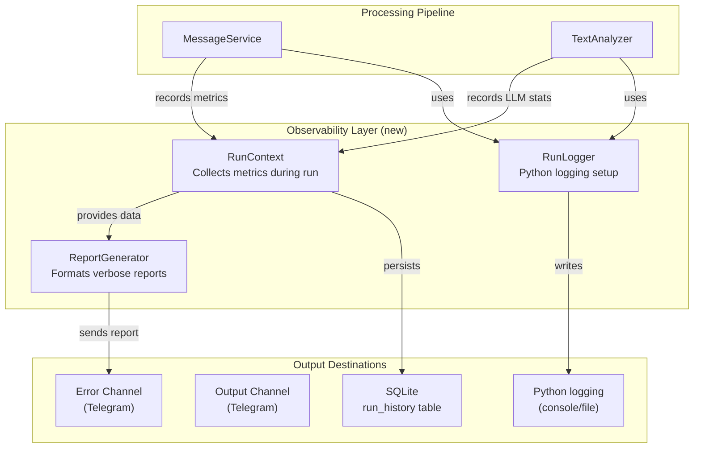
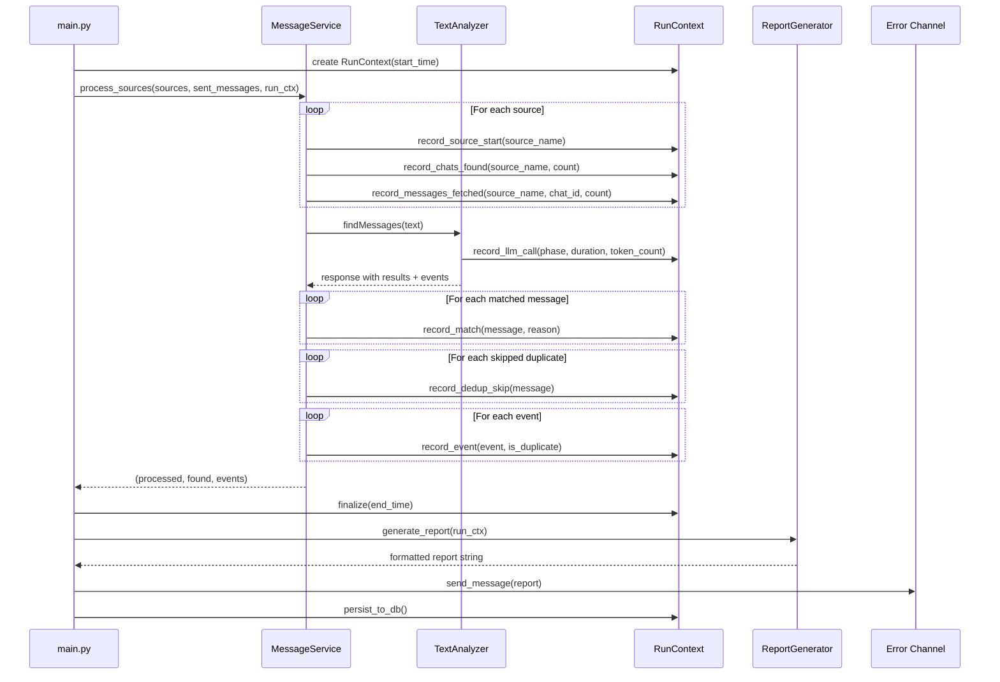

# Design: Verbose Logging, Reporting & Observability

> **Status**: Draft
> **Author**: Design Architect Agent
> **Date**: March 29, 2026
> **Scope**: `main.py`, `service/messageService.py`, `service/textAnalyzer.py`, `service/util.py`, `service/dbService.py`, `source/telegramSource.py`, `source/whatsappSource.py`

---

## 1. Problem Statement

The system currently produces minimal output:
- A single summary line: `Execution completed. Messages processed: X, Messages found: Y, Events found: Z`
- Error-only messages to the error Telegram channel
- Scattered `print()` / `sys.stderr.write()` with no structured format

This makes it **difficult to**:

1. **Diagnose false positives** — When the LLM flags an unrelated message as relevant, the user only sees it in the output channel with no explanation of *why* it was matched, and no easy way to report it for prompt tuning.
2. **Detect false negatives** — When a genuinely relevant message is missed, there is **no mechanism** to discover this happened. The user must manually compare output against source chats.
3. **Understand per-chat behavior** — No breakdown of which chats contributed messages, how many were analyzed vs. matched, helping the user tune which groups to monitor.
4. **Audit LLM decisions** — No visibility into what the LLM received and returned (phase 1 classification results, phase 2 event extraction), making prompt optimization a guessing game.
5. **Track processing performance** — No timing data for LLM calls, message fetching, or overall pipeline stages.
6. **Monitor deduplication** — Duplicate message filtering (`is_message_in_list`) and event deduplication are silent or only printed to stdout.
7. **Observe trends** — No historical persistence of run metrics, so it's impossible to see whether match rates, error rates, or processing times are improving or degrading.

---

## 2. Project Context

### 2.1 Tech Stack
- Python 3.10+, async (Telethon), OpenRouter LLM (Gemini Flash), SQLite, Google Calendar API
- Two message sources: TelegramSource, WhatsAppSource via MessageSource protocol
- Reports delivered as Telegram messages to output and error channels

### 2.2 Architecture Patterns
- Service-oriented: `MessageService` orchestrates, `TextAnalyzer` does LLM, `DBService` persists
- All user-facing output goes through Telegram client (`client.send_message` to `PeerChannel`)
- No structured logging framework in use — only `print()`, `sys.stderr.write()`, and one `logging.getLogger` in `textAnalyzer.py` (barely used)

### 2.3 Current Logging Inventory

| Location | Mechanism | What it logs |
|----------|-----------|--------------|
| `main.py:64` | `client.send_message` (error channel) | Final summary: processed/found/events counts |
| `main.py:48` | `client.send_message` (error channel) | WhatsApp health check failure warning |
| `messageService.py` | `client.send_message` (error channel) | Chat fetch errors, message fetch errors, LLM errors, individual report errors, event creation errors |
| `messageService.py:120-135` | `client.send_message` (error channel) | Hallucination recovery info + still-missing-IDs warning |
| `messageService.py:175` | `print()` | Duplicate event detection (stdout only) |
| `textAnalyzer.py:88` | `sys.stderr.write()` | LLM call failures |
| `textAnalyzer.py:96` | `sys.stderr.write()` | Phase 1 parse failures |
| `textAnalyzer.py:101` | `print()` | `Messages found: N` (stdout only) |
| `textAnalyzer.py:73-74` | `logger.warning()` | Unparseable datetime in post-processing |

### 2.4 Gaps Identified

| # | Gap | Impact |
|---|-----|--------|
| G1 | No false-positive reporting mechanism | User can't easily flag/review incorrectly matched messages |
| G2 | No false-negative detection mechanism | Missed relevant messages go unnoticed |
| G3 | No per-chat statistics | Can't tell which groups are valuable vs. noisy |
| G4 | No LLM decision transparency | Can't understand why messages were matched or skipped |
| G5 | No pipeline timing metrics | Can't identify bottlenecks (LLM latency, API calls) |
| G6 | Silent dedup filtering | Duplicate message skips are invisible |
| G7 | Event dedup only on stdout | Not recorded in error channel or DB |
| G8 | No configuration summary at startup | Hard to verify what parameters were active during a run |
| G9 | No run history persistence | Can't detect trends in match rates, errors, LLM quality |
| G10 | Inconsistent logging mechanisms | Mix of `print()`, `sys.stderr`, `logging`, Telegram messages |

---

## 3. Proposed Design

### 3.1 Overview

Introduce a **multi-layer observability system** that provides:

1. **Structured execution report** — A detailed end-of-run report sent to the error channel with per-chat breakdowns, timing, dedup stats, and LLM decision summaries.
2. **False-positive feedback mechanism** — Add a "reason" field to each matched message report so the user can understand *why* the LLM matched it, and an inline marker to simplify mental flagging.
3. **False-negative detection aids** — A summary of "borderline" messages the LLM considered but rejected, plus sample unmatched messages from high-match-rate chats.
4. **Python `logging` standardization** — Replace all `print()`/`sys.stderr.write()` with structured `logging` calls.
5. **Run metrics persistence** — Store per-run statistics in SQLite for historical trend analysis.
6. **Configurable verbosity** — An environment variable (`LOG_VERBOSITY`) to control how much detail goes to the error channel (e.g., `minimal`, `normal`, `verbose`).

### 3.2 Component Diagram



### 3.3 Data Flow — Enhanced Reporting



### 3.4 New/Modified Components

#### 3.4.1 `RunContext` (new dataclass / simple class)
**File**: `service/runContext.py` (new)

Accumulates all metrics during a single pipeline run. Passed through the pipeline as a parameter. Not a global — created in `main.py`, passed to `MessageService`.

**Key fields**:
```
start_time: datetime
end_time: datetime
sources_stats: Dict[str, SourceStats]  # per-source metrics
    - chats_found: int
    - messages_fetched: int  (total across all chats)
    - per_chat: Dict[str, ChatStats]
        - chat_title: str
        - messages_fetched: int
        - messages_matched: int
total_messages: int
total_matched: int
total_events: int
total_events_deduplicated: int
llm_phase1_duration_sec: float
llm_phase2_duration_sec: float
llm_phase1_tokens: Optional[int]  (if available from response)
llm_phase2_tokens: Optional[int]
hallucination_recoveries: int
still_missing_ids: List[str]
dedup_skips: List[DedupSkipInfo]  # messages skipped by is_message_in_list
matched_messages: List[MatchInfo]  # message_id, chat, reason from LLM
borderline_messages: List[BorderlineInfo]  # messages the LLM saw but didn't match (sample)
event_dedup_details: List[EventDedupInfo]  # title, similarity_score, matched_against
errors: List[str]  # accumulated non-fatal errors
```

#### 3.4.2 `ReportGenerator` (new utility class)
**File**: `service/reportGenerator.py` (new)

Takes a `RunContext` and produces formatted Telegram messages. Verbosity is controlled by `LOG_VERBOSITY` env var.

**Three verbosity levels**:

| Level | Content |
|-------|---------|
| `minimal` | Same as current: `Execution completed. Messages processed: X, Messages found: Y, Events found: Z` |
| `normal` (default) | Per-source/per-chat breakdown, dedup stats, event dedup details, timing, errors summary |
| `verbose` | Everything in `normal` + borderline message samples, LLM token usage, full matched-message list with reasons, full event dedup log |

#### 3.4.3 `TextAnalyzer` Enhancements
**File**: `service/textAnalyzer.py` (modified)

**Changes**:
- Add `has_explicit_datetime` field to Phase 1 schema (already present — good)
- **New**: Request the LLM to return a `reason` field for each matched message in Phase 1, explaining *why* it was considered event-related. This requires a Phase 1 schema + prompt update.
- **New**: Capture and return `response.usage` (token counts) if available from the LLM response
- **New**: Time each LLM call and return duration alongside results
- Replace `print("Messages found: ...")` with `logging.info()`
- Replace `sys.stderr.write()` with `logging.error()`

#### 3.4.4 `MessageService` Enhancements
**File**: `service/messageService.py` (modified)

**Changes**:
- Accept `RunContext` parameter in `process_sources()`
- Record per-chat statistics as messages are fetched
- Record each match/skip/dedup event into `RunContext`
- Log dedup skips when `is_message_in_list` returns True
- Send event dedup details to `RunContext` instead of just `print()`

#### 3.4.5 `DBService` Extensions
**File**: `service/dbService.py` (modified)

**New table**: `run_history` for persisting per-run metrics.

#### 3.4.6 Configuration
**File**: `model/envLoader.py` (modified)

**New env var**: `LOG_VERBOSITY` — values: `minimal`, `normal`, `verbose`. Default: `normal`.

---

## 4. Detailed Feature Designs

### 4.1 Case 1: Simplify Report of Unrelated Message Match (False Positive Transparency)

**Problem**: User sees a matched message in the output channel but it's irrelevant. No way to understand *why* the LLM thought it matched, and no easy way to provide feedback.

**Solution**:

1. **Add `reason` field to Phase 1 LLM output**. Update the Phase 1 schema and prompt so the LLM returns a brief reason (1 sentence) for why each message was classified as event-related.

2. **Include reason in the output report**. Append a footer line to each message report: `🏷️ Match reason: {reason}`. This lets the user immediately understand the LLM's reasoning and mentally flag false positives.

3. **Include match reasons in the verbose execution summary**. In the end-of-run error channel report, list all matched messages with their reasons, so the user can review them in bulk without scrolling the output channel.

4. **Log sample unmatched messages at `verbose` level**. In the execution report, include 3-5 random unmatched messages from each chat with high message counts, so the user can spot-check that irrelevant messages are correctly being ignored.

**Schema change for Phase 1**:
```json
{
  "chat_id": "string",
  "message_id": "string",
  "text": "string",
  "has_explicit_datetime": "boolean",
  "reason": "string"     // NEW: 1-sentence reason for classification
}
```

### 4.2 Case 2: Detecting Missed Relevant Messages (False Negative Detection)

**Problem**: If the LLM misses a relevant event message, the user has no way to know — they'd need to manually read all source chats.

**Solution**:

1. **Borderline detection via Phase 1 prompt enhancement**. Ask the LLM to also return a `borderline` array: messages it considered but ultimately decided were NOT events, with a reason for exclusion. These are "near misses" — the most valuable for prompt tuning.

2. **Borderline summary in execution report**. At `normal` and `verbose` verbosity, include a "Borderline Messages" section listing these near-misses with their exclusion reason. Example:

   ```
   ⚠️ Borderline Messages (considered but excluded):
   • [Chat: Ивенты в Барселоне] "гуляем в субботу кто-нибудь?" — Excluded: Too vague, no specific event details
   • [Chat: Квизы] "кто был вчера на квизе?" — Excluded: Past event discussion, not announcement
   ```

3. **High-match-rate chat alerts**. If a chat has an unusually high match rate (>60% of messages matched), flag it in the report — this could indicate the prompt is too aggressive for that chat. Conversely, if a typically-active event chat has 0 matches, flag that too.

4. **Periodic sample audit**. At `verbose` level, include 2-3 random unmatched messages from each chat so the user can spot-check for missed events.

**Schema change for Phase 1**:
```json
{
  "found": "boolean",
  "results": [...],
  "borderline": [              // NEW
    {
      "chat_id": "string",
      "message_id": "string",
      "text": "string",
      "exclusion_reason": "string"
    }
  ]
}
```

### 4.3 Case 3: Per-Chat Statistics Breakdown

**Problem**: The user doesn't know which chats are contributing the most messages, matches, or noise.

**Solution**: In the execution report, add a per-chat table:

```
📊 Per-Chat Breakdown:
┌──────────────────────────┬────────┬─────────┬───────┬──────────┐
│ Chat                     │ Source │ Fetched │ Match │ Rate     │
├──────────────────────────┼────────┼─────────┼───────┼──────────┤
│ Ивенты в Барселоне       │ TG     │ 45      │ 3     │ 6.7%     │
│ Квизы                    │ TG     │ 22      │ 5     │ 22.7% ⚠️│
│ Мадридские пташки        │ TG     │ 80      │ 1     │ 1.3%     │
│ Madrid Expats            │ WA     │ 30      │ 2     │ 6.7%     │
└──────────────────────────┴────────┴─────────┴───────┴──────────┘
```

The `⚠️` marker appears when match rate is abnormally high (>20%), suggesting the LLM may be over-matching for that chat.

### 4.4 Case 4: Duplicate Message/Event Deduplication Transparency

**Problem**: When `is_message_in_list` silently skips a duplicate, or when event deduplication triggers, there's no record in the error channel.

**Solution**:

1. **Log each dedup skip with context**:
   ```
   🔄 Dedup: Skipped message from "Ивенты в Барселоне" (already reported with same text)
   ```

2. **Log event deduplication with similarity scores** (already partially done with `print()`, move to report):
   ```
   📅 Event Dedup:
   • "Встреча в Ретиро" ↔ existing "Встреча в парке Ретиро" (similarity: 0.85) → Linked to existing
   • "Квиз в баре" → New event, created in Google Calendar
   ```

### 4.5 Case 5: LLM Call Transparency & Performance

**Problem**: No visibility into LLM call duration, token usage, or retry behavior.

**Solution**:

1. **Time each LLM call**:
   ```
   ⏱️ LLM Performance:
   • Phase 1 (classification): 3.2s, ~2,400 tokens input
   • Phase 2 (event extraction): 1.1s, ~600 tokens input
   • Retries: 0
   ```

2. **Log retries explicitly** — the current `@retry` decorator silently retries. Add a `before_sleep` callback that logs each retry attempt.

### 4.6 Case 6: Startup Configuration Summary

**Problem**: When reviewing logs, it's unclear what configuration was active during the run.

**Solution**: At the start of each run, log to Python logger (not error channel):

```
[INFO] === Run started at 2026-03-29 14:00:00 ===
[INFO] Sources: Telegram (filter: "events"), WhatsApp (label: "Monitor")
[INFO] LLM Model: google/gemini-2.0-flash-exp:free
[INFO] Timezone: Europe/Madrid
[INFO] Verbosity: normal
[INFO] WhatsApp enabled: yes (WAHA: http://localhost:3000)
```

### 4.7 Case 7: Hallucination Recovery Transparency

**Problem**: Hallucination recovery is reported with raw IDs only, making it hard to understand what happened.

**Solution**: Enhance the recovery report with message context:

```
🔧 Hallucination Recovery:
• LLM returned ID "99999" (not found) → Matched by text to actual message ID "46422" 
  from "Ивенты в Барселоне": "Приглашаем всех на встречу..."
• LLM returned ID "88888" → ❌ No match found by text either
```

### 4.8 Case 8: Run History & Trend Analysis

**Problem**: No way to compare runs over time — is the match rate improving? Are errors increasing?

**Solution**: Persist per-run stats in a new `run_history` SQLite table:

```sql
CREATE TABLE IF NOT EXISTS run_history (
    id INTEGER PRIMARY KEY AUTOINCREMENT,
    run_timestamp DATETIME NOT NULL,
    duration_sec REAL,
    sources_count INTEGER,
    chats_count INTEGER,
    messages_processed INTEGER,
    messages_matched INTEGER,
    events_found INTEGER,
    events_deduplicated INTEGER,
    hallucination_recoveries INTEGER,
    dedup_skips INTEGER,
    errors_count INTEGER,
    llm_phase1_duration_sec REAL,
    llm_phase2_duration_sec REAL,
    verbosity TEXT,
    match_rate REAL  -- messages_matched / messages_processed
);
```

At `verbose` level, include a mini trend comparison in the report:

```
📈 Trend (last 5 runs):
• Avg match rate: 4.2% (this run: 5.1% — slightly above average)
• Avg processing time: 8.3s (this run: 7.1s — faster)
• Avg hallucination recoveries: 0.4 (this run: 0 — clean)
```

---

## 5. Decision Log

| # | Decision | Options Considered | Chosen | Rationale |
|---|----------|-------------------|--------|-----------|
| 1 | Where to send verbose reports | A) Error channel only, B) Separate "audit" channel, C) Error channel + file log | A | Keeps it simple; error channel is already the ops channel. File logging augments for deeper analysis. Avoid creating another channel. |
| 2 | How to add `reason` to matches | A) Modify Phase 1 schema (add field), B) Add a Phase 1.5 call to explain matches, C) Post-hoc heuristic | A | Single LLM call, structured output, no extra latency. B doubles LLM costs. C is unreliable. |
| 3 | How to detect false negatives | A) Borderline array from LLM, B) Separate "verification" LLM call, C) User feedback loop | A | Low-cost addition to existing Phase 1 prompt. B doubles cost. C requires UI work. |
| 4 | Report format | A) Plain text with emoji markers, B) HTML tables, C) Markdown | A | Telegram renders plain text reliably. HTML support is limited. Markdown not supported in Telegram. |
| 5 | Run metrics persistence | A) SQLite table, B) JSON log files, C) No persistence | A | Consistent with existing SQLite usage. Enables SQL trend queries. |
| 6 | Verbosity control | A) Single env var with levels, B) Per-feature flags, C) Always verbose | A | Simple, single knob. B is over-engineered. C is noisy for daily use. |
| 7 | Logging mechanism | A) Python `logging` module, B) Keep `print()`/`stderr`, C) Custom logger | A | Standard Python practice. Configurable handlers (console, file). Already partially imported. |

---

## 6. Impact Analysis

### 6.1 Breaking Changes

- **Phase 1 LLM schema change**: Adding `reason` and `borderline` fields. The schema uses `strict: True`, so both field additions and prompt changes must be coordinated. The `additionalProperties: False` constraint means the schema must be updated atomically with the prompt.
- **`process_sources()` signature change**: Adding `run_ctx` parameter. Only called from `main.py`, so single call-site update.

### 6.2 Security Considerations

- Run history and borderline messages stored in local SQLite — no new external exposure.
- Message text samples in verbose reports go to the error channel (same trust boundary as existing error messages).
- No new external API calls introduced.

### 6.3 Performance Considerations

- **LLM cost increase**: Adding `reason` and `borderline` fields to Phase 1 output increases output tokens by ~20-50%. Input tokens unchanged. Since the model is `free` tier, monetary cost is zero, but response time may increase slightly.
- **SQLite writes**: One additional INSERT per run (negligible).
- **Report generation**: String formatting — negligible CPU cost.
- **Timing instrumentation**: `time.time()` calls — negligible overhead.

### 6.4 Testing Strategy

- Unit tests for `ReportGenerator` formatting at each verbosity level
- Unit tests for `RunContext` metric accumulation
- Integration test verifying `run_history` table is populated after a run
- Manual verification of Telegram report formatting (visual check)

---

## 7. Risks & Open Questions

| # | Risk/Question | Severity | Mitigation/Answer |
|---|---------------|----------|-------------------|
| 1 | LLM may produce low-quality `reason` fields, adding noise | Medium | Keep reason optional in processing — if empty/useless, skip. Prompt engineering to request concise 1-sentence reasons. |
| 2 | `borderline` array may be inconsistently populated across LLM models | Medium | Treat as best-effort. If empty, simply omit section from report. |
| 3 | Verbose report may exceed Telegram's 4096-char message limit | High | Split report into multiple messages (chunk by section). `ReportGenerator` must handle this. |
| 4 | Adding fields to Phase 1 schema may cause LLM JSON generation failures | Medium | Test with current model. Schema remains `strict: True`. Fall back to current behavior if new fields are missing. |
| 5 | `borderline` increases output token count, potentially hitting rate limits on free tier | Low | Limit `borderline` to max 5 entries in prompt instructions. |

---
<!-- SECTION BELOW IS FOR AI IMPLEMENTATION AGENTS -->

## 8. Implementation Plan

> **Instructions for AI Agent**: Execute the steps below in order.
> Each step includes the exact files to modify, what to change, and how
> to verify. Do not skip verification steps.

### Step 1: Standardize Python Logging

- **Files**: `service/textAnalyzer.py`, `service/messageService.py`, `main.py`, `service/calendarService.py`
- **Action**: Replace all `print()` and `sys.stderr.write()` calls with Python `logging` module calls. Configure a basic logging setup in `main.py`.
- **Details**:
  - Add `import logging` and `logger = logging.getLogger(__name__)` at the top of each service file (already done in `textAnalyzer.py`).
  - In `main.py`, add before the `main()` function:
    ```python
    import logging
    logging.basicConfig(
        level=logging.INFO,
        format='%(asctime)s [%(levelname)s] %(name)s: %(message)s',
        datefmt='%Y-%m-%d %H:%M:%S',
    )
    logger = logging.getLogger(__name__)
    ```
  - Replace `textAnalyzer.py` line `print("Messages found: {}".format(len(results)))` → `logger.info("Phase 1 — messages found: %d", len(results))`
  - Replace `textAnalyzer.py` `sys.stderr.write(...)` calls → `logger.error(...)`
  - Replace `messageService.py` `print(f"Duplicate event detected: ...")` → `logger.info("Duplicate event detected: ...")`
  - Replace `calendarService.py` `print(f"Deleted event: ...")` → `logger.info("Deleted event: ...")`
- **Verification**:
  - [ ] `grep -rn "print(" service/ main.py` returns only non-logging prints (e.g., `if __name__` blocks)
  - [ ] `grep -rn "sys.stderr.write" service/` returns zero results
  - [ ] Run script — console shows timestamped log lines

### Step 2: Add `LOG_VERBOSITY` Environment Variable

- **Files**: `model/envLoader.py`
- **Action**: Add a `log_verbosity` property.
- **Details**:
  - Add property:
    ```python
    @property
    def log_verbosity(self):
        return self.get("LOG_VERBOSITY", "normal").lower()
    ```
  - Valid values: `minimal`, `normal`, `verbose`. No validation needed — `ReportGenerator` will treat unknown values as `normal`.
- **Verification**:
  - [ ] `EnvLoader().log_verbosity` returns `"normal"` with no env var set
  - [ ] Setting `LOG_VERBOSITY=verbose` returns `"verbose"`

### Step 3: Create `RunContext` Data Class

- **Files**: `service/runContext.py` (new)
- **Action**: Create a class to accumulate run metrics.
- **Details**:
  - Define `RunContext` with:
    - `start_time`, `end_time`: `datetime`
    - `source_stats`: nested dict tracking per-source, per-chat counts (fetched, matched)
    - `llm_phase1_duration_sec`, `llm_phase2_duration_sec`: `float`
    - `llm_phase1_tokens`, `llm_phase2_tokens`: `Optional[int]`
    - `hallucination_recoveries`: `int`
    - `still_missing_ids`: `List[str]`
    - `dedup_skips`: `List[dict]` — each has `message_id`, `chat_title`, `text_preview` (first 60 chars)
    - `matched_messages`: `List[dict]` — each has `message_id`, `chat_title`, `text_preview`, `reason`
    - `borderline_messages`: `List[dict]` — each has `message_id`, `chat_title`, `text_preview`, `exclusion_reason`
    - `event_results`: `List[dict]` — each has `title`, `is_duplicate`, `similarity_score`, `matched_against`
    - `errors`: `List[str]`
  - Provide helper methods: `record_messages_fetched(source, chat_id, chat_title, count)`, `record_match(message_id, chat_title, text, reason)`, `record_dedup_skip(message_id, chat_title, text)`, `record_borderline(message_id, chat_title, text, exclusion_reason)`, `record_event(title, is_duplicate, similarity_score, matched_against)`, `record_error(error_str)`, `finalize(end_time)`
  - Property: `match_rate` → returns `matched / total` or 0.0
  - Property: `duration_sec` → returns `(end_time - start_time).total_seconds()`
  - Method: `get_chat_stats()` → returns list of dicts with per-chat summary sorted by fetched count desc
  - Method: `get_high_match_rate_chats(threshold=0.20)` → returns chats where match_rate > threshold
  - Method: `get_zero_match_chats()` → returns chats with 0 matches but >5 messages fetched
- **Verification**:
  - [ ] `python -c "from service.runContext import RunContext"` succeeds
  - [ ] Unit test: create RunContext, record some metrics, verify `match_rate` and `get_chat_stats()`

### Step 4: Create `ReportGenerator`

- **Files**: `service/reportGenerator.py` (new)
- **Action**: Create a class that formats `RunContext` into Telegram-ready text reports.
- **Details**:
  - Constructor takes `verbosity: str` (from `env.log_verbosity`)
  - Method `generate(run_ctx: RunContext) -> List[str]` — returns a list of message strings (multiple if content exceeds 4000 chars)
  - **`minimal` output**:
    ```
    Execution completed.
    Messages processed: {N},
    Messages found: {M},
    Events found: {E}
    ```
  - **`normal` output** (adds to minimal):
    ```
    ⏱️ Duration: {X}s (Phase 1: {Y}s, Phase 2: {Z}s)
    
    📊 Per-Chat Breakdown:
    • {chat_title} ({source}): {fetched} fetched, {matched} matched ({rate}%){warning}
    • ...
    
    🔄 Dedup: {N} messages skipped (already reported)
    
    📅 Events:
    • "{title}" → New / Duplicate (↔ "{existing}", similarity: {score})
    • ...
    
    🔧 Hallucination Recovery: {N} recovered, {M} still missing
    
    ⚠️ Borderline Messages ({N}):
    • [{chat}] "{text_preview}..." — {exclusion_reason}
    • ...
    
    ❌ Errors: {N} non-fatal errors
    ```
  - **`verbose` output** (adds to normal):
    ```
    🏷️ Matched Messages with Reasons:
    • [{chat}] "{text_preview}..." — Reason: {reason}
    • ...
    
    🔍 Sample Unmatched (spot-check):
    • [{chat}] "{text_preview}..."
    • ...
    
    📈 Trend (last 5 runs):
    • Avg match rate: {X}% (this run: {Y}%)
    • Avg duration: {X}s (this run: {Y}s)
    
    🔢 LLM Tokens: Phase 1: ~{N} input, Phase 2: ~{M} input
    ```
  - Chunking: Split output into messages of ≤4000 chars at section boundaries (never mid-line).
- **Verification**:
  - [ ] Unit test: pass a populated RunContext to ReportGenerator at each verbosity level, verify output structure
  - [ ] Verify chunking: create a RunContext with 50+ borderline messages, confirm output is split into multiple messages

### Step 5: Update Phase 1 LLM Schema & Prompt

- **Files**: `service/textAnalyzer.py`, `base_phase1.prompt`
- **Action**: Add `reason` field to Phase 1 results schema. Add `borderline` array to Phase 1 output schema. Update prompt accordingly.
- **Details**:
  - In `PHASE1_SCHEMA`, add `"reason"` to `results.items.required` and `results.items.properties`:
    ```python
    "reason": {"type": "string"}
    ```
  - In `PHASE1_SCHEMA`, add `"borderline"` to the top-level `required` and `properties`:
    ```python
    "borderline": {
        "type": "array",
        "items": {
            "type": "object",
            "required": ["chat_id", "message_id", "text", "exclusion_reason"],
            "properties": {
                "chat_id": {"type": "string"},
                "message_id": {"type": "string"},
                "text": {"type": "string"},
                "exclusion_reason": {"type": "string"}
            },
            "additionalProperties": False
        }
    }
    ```
  - Update `base_phase1.prompt`:
    - Add to rules: `7. For each message in "results", include a "reason" field: a concise 1-sentence explanation of why this message describes an event.`
    - Add new section: `"borderline" rules: Include up to 5 messages that you considered might be event-related but ultimately excluded. For each, provide an "exclusion_reason" explaining why it was not classified as event-related.`
    - Update the example output to include `reason` and `borderline` fields.
  - In `findMessages()`, extract `borderline` from phase1 response: `borderline = phase1.get('borderline', [])`
  - Return borderline in the result dict: `return {"results": results, "Events": events, "borderline": borderline}`
- **Verification**:
  - [ ] Run the script with test messages — Phase 1 response includes `reason` and `borderline` fields
  - [ ] If LLM fails to produce new fields, verify fallback: empty `reason` and `borderline` don't crash the pipeline

### Step 6: Instrument `TextAnalyzer` with Timing & Token Tracking

- **Files**: `service/textAnalyzer.py`
- **Action**: Add timing and token usage capture to LLM calls.
- **Details**:
  - Import `time` module
  - In `findMessages()`, wrap Phase 1 call:
    ```python
    t0 = time.time()
    response = self.__call_llm(...)
    phase1_duration = time.time() - t0
    ```
  - Same for Phase 2 call
  - Extract token counts from response: `response.usage.total_tokens` if available (may be `None` for some providers)
  - Add `phase1_duration`, `phase2_duration`, `phase1_tokens`, `phase2_tokens` to return dict:
    ```python
    return {
        "results": results,
        "Events": events,
        "borderline": borderline,
        "_meta": {
            "phase1_duration_sec": phase1_duration,
            "phase2_duration_sec": phase2_duration,
            "phase1_tokens": phase1_tokens,
            "phase2_tokens": phase2_tokens,
        }
    }
    ```
  - Add retry logging: add `before_sleep` callback to `@retry` decorator:
    ```python
    from tenacity import before_sleep_log
    @retry(stop=stop_after_attempt(10), wait=wait_fixed(30),
           before_sleep=before_sleep_log(logger, logging.WARNING))
    ```
- **Verification**:
  - [ ] Run script — log shows Phase 1/Phase 2 timing
  - [ ] Check `_meta` key is present in `findMessages()` return value

### Step 7: Integrate `RunContext` into `MessageService.process_sources()`

- **Files**: `service/messageService.py`, `main.py`
- **Action**: Pass `RunContext` through the pipeline and record all metrics.
- **Details**:
  - In `main.py`: create `RunContext(start_time=datetime.now(timezone.utc))` before `process_sources()`, pass it in, finalize after.
  - Update `process_sources()` signature: `async def process_sources(self, sources, sent_messages, run_ctx=None)`
  - After fetching messages from each chat, call: `run_ctx.record_messages_fetched(source.source_name, chat.chat_id, chat_title, len(messages))`
  - After LLM call, extract `_meta` and record: `run_ctx.llm_phase1_duration_sec = meta['phase1_duration_sec']` etc.
  - Extract `borderline` from response and record each into `run_ctx`
  - In the match loop, call: `run_ctx.record_match(message_found.message_id, chat_title, text_preview, reason)`
  - When `is_message_in_list` returns True, call: `run_ctx.record_dedup_skip(message_found.message_id, chat_title, text_preview)`
  - In `_process_single_event`, call: `run_ctx.record_event(title, is_duplicate, similarity_score, matched_against_title)`
  - In each `except` block, also call: `run_ctx.record_error(str(e))`
  - Record hallucination recovery counts and still-missing IDs
- **Verification**:
  - [ ] Run script — `RunContext` is populated with all expected metrics
  - [ ] `run_ctx.match_rate` returns a sensible value
  - [ ] `run_ctx.get_chat_stats()` returns per-chat breakdown

### Step 8: Add `run_history` Table and Persistence

- **Files**: `service/dbService.py`
- **Action**: Add `run_history` table and `store_run()` method.
- **Details**:
  - In `_create_tables()`, add:
    ```sql
    CREATE TABLE IF NOT EXISTS run_history (
        id INTEGER PRIMARY KEY AUTOINCREMENT,
        run_timestamp DATETIME NOT NULL,
        duration_sec REAL,
        sources_count INTEGER,
        chats_count INTEGER,
        messages_processed INTEGER,
        messages_matched INTEGER,
        events_found INTEGER,
        events_deduplicated INTEGER,
        hallucination_recoveries INTEGER,
        dedup_skips INTEGER,
        errors_count INTEGER,
        llm_phase1_duration_sec REAL,
        llm_phase2_duration_sec REAL,
        verbosity TEXT,
        match_rate REAL
    );
    ```
  - Add method `store_run(run_ctx: RunContext)` that INSERTs the stats.
  - Add method `get_recent_runs(n: int = 5) -> List[Tuple]` that fetches the last N runs for trend comparison.
- **Verification**:
  - [ ] Table is created on first run
  - [ ] After a run, `SELECT * FROM run_history` shows one row with correct values
  - [ ] `get_recent_runs(5)` returns results

### Step 9: Wire Up `ReportGenerator` in `main.py`

- **Files**: `main.py`
- **Action**: Replace current summary message with ReportGenerator output.
- **Details**:
  - After `process_sources()` returns and `run_ctx` is finalized:
    ```python
    from service.reportGenerator import ReportGenerator
    from service.runContext import RunContext

    run_ctx.finalize(datetime.now(timezone.utc))
    db_service.store_run(run_ctx)

    report_gen = ReportGenerator(env.log_verbosity)
    # Pass db_service for trend data at verbose level
    report_messages = report_gen.generate(run_ctx, db_service if env.log_verbosity == 'verbose' else None)
    for msg in report_messages:
        await client.send_message(PeerChannel(env.error_dialog_id), msg)
    ```
  - Remove the existing final `client.send_message(... f'Execution completed...')` call.
  - Add startup configuration log:
    ```python
    logger.info("=== Run started ===")
    logger.info("Sources: %s", ", ".join(s.source_name for s in sources))
    logger.info("LLM Model: %s", env.llm_model)
    logger.info("Timezone: %s", env.timezone)
    logger.info("Verbosity: %s", env.log_verbosity)
    ```
- **Verification**:
  - [ ] Run with `LOG_VERBOSITY=minimal` — output matches current format
  - [ ] Run with `LOG_VERBOSITY=normal` — includes per-chat breakdown, dedup, timing
  - [ ] Run with `LOG_VERBOSITY=verbose` — includes borderline, trends, LLM tokens
  - [ ] Reports exceeding 4000 chars are split into multiple messages

### Step 10: Update `base.prompt` (Unified Prompt Compatibility)

- **Files**: `base.prompt`
- **Action**: Ensure the unified prompt (if still used) reflects the same `reason` and `borderline` additions as `base_phase1.prompt`.
- **Details**:
  - Add `"reason": "string"` to the results items in the example output
  - Add a `"borderline"` array to the schema description and example
  - Keep backward compatible: if the unified prompt is the primary one, it must produce the new fields
- **Verification**:
  - [ ] If `BASE_PROMPT_FILE` points to `base.prompt`, the LLM still returns valid JSON with new fields
  - [ ] If `BASE_PROMPT_FILE` points to `base_phase1.prompt`, same verification

---

## 9. Verification Checklist

> **Instructions for AI Agent**: After completing ALL steps, run through
> this final checklist.

- [ ] All `print()` and `sys.stderr.write()` replaced with `logging` calls
- [ ] No lint errors: `python -m py_compile main.py service/messageService.py service/textAnalyzer.py service/runContext.py service/reportGenerator.py`
- [ ] All existing behavior preserved at `LOG_VERBOSITY=minimal`
- [ ] New `run_history` table created on startup
- [ ] Phase 1 LLM response includes `reason` and `borderline` fields
- [ ] Verbose report includes per-chat breakdown, borderline messages, timing, trends
- [ ] Reports exceeding 4000 chars are properly chunked
- [ ] Pipeline does not crash if LLM omits `reason` or `borderline` (graceful fallback)
- [ ] `RunContext` is populated with all metrics by end of run
- [ ] Startup log shows configuration summary
- [ ] Event dedup details recorded in report (not just stdout)
- [ ] Dedup skip messages recorded in report
- [ ] Hallucination recovery report includes message context (not just IDs)

---

## 10. Summary of All Proposed Cases

| # | Case | Problem | Solution | Verbosity Level |
|---|------|---------|----------|-----------------|
| 1 | False positive transparency | User can't tell why a message was matched | Add `reason` field to Phase 1 LLM output; show in report | `normal`+ |
| 2 | False negative detection | Missed events go unnoticed | Add `borderline` array from LLM; show near-misses in report | `normal`+ |
| 3 | Per-chat statistics | No visibility into which chats are noisy or valuable | Per-chat table with fetched/matched/rate breakdown | `normal`+ |
| 4 | Dedup transparency | Silent filtering of duplicate messages and events | Log each skip with context; summarize in report | `normal`+ |
| 5 | LLM performance metrics | No timing or token data for LLM calls | Instrument calls; show duration and token usage | `normal` (timing), `verbose` (tokens) |
| 6 | Configuration summary | Can't tell what parameters were active | Log config at startup to Python logger | Always (Python log) |
| 7 | Hallucination detail | Recovery reported with raw IDs only | Include message text preview and chat context | `normal`+ |
| 8 | Run history & trends | No historical comparison between runs | Persist metrics in SQLite; show trends at verbose level | `verbose` (trends), always (persistence) |
| 9 | High/zero match rate alerts | Prompt may be too aggressive or too lax for specific chats | Flag chats with >20% or 0% match rate in report | `normal`+ |
| 10 | Sample unmatched audit | No spot-check for missed messages in quiet chats | Show random unmatched samples at verbose level | `verbose` |

---

<small>Generated by Design Architect agent with GitHub Copilot</small>
