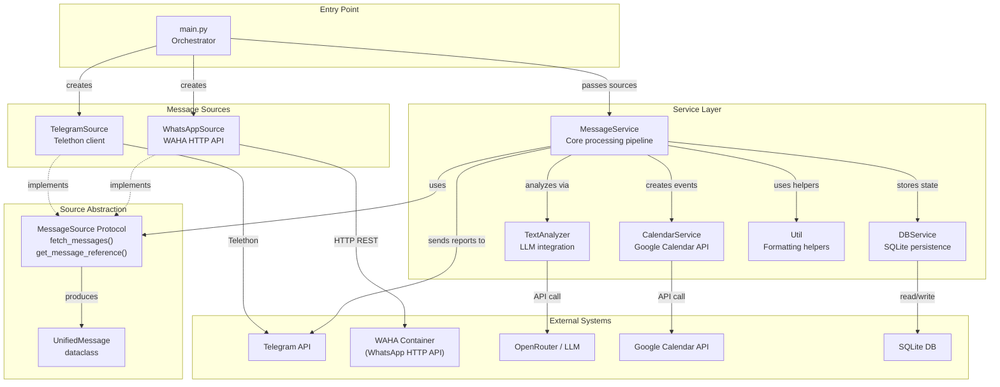
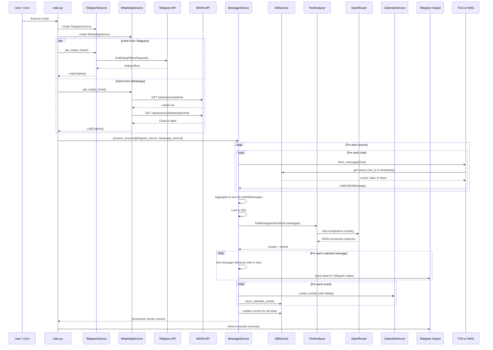

# Design: WhatsApp Integration via WAHA

> **Status**: Draft
> **Author**: Design Architect Agent
> **Date**: March 28, 2026
> **Scope**: Full system — `main.py`, `model/`, `service/`, new `source/` layer

---

## 1. Problem Statement

The system currently monitors only **Telegram** groups for relevant messages and events. The user also participates in **WhatsApp** groups that require the same monitoring, analysis, and event extraction capabilities.

**Goal**: Add WhatsApp as a second message source via [WAHA (WhatsApp HTTP API)](https://waha.devlike.pro/), while keeping the existing Telegram functionality intact. Both sources should feed into the same LLM analysis pipeline, calendar integration, and Telegram output channel.

**Why now**: The user needs consolidated message monitoring across both platforms without maintaining two separate tools.

---

## 2. Project Context

### 2.1 Tech Stack

| Component        | Technology                                      |
|------------------|-------------------------------------------------|
| Language         | Python 3.10+                                    |
| Telegram Client  | Telethon 1.29.1                                 |
| LLM Integration  | OpenAI SDK 1.57.0 via OpenRouter                |
| Calendar         | Google Calendar API v3 (service account)         |
| Database         | SQLite 3 (`messages.db`)                        |
| Retry Logic      | Tenacity 8.2.3                                  |
| Env Management   | python-dotenv 1.0.0                             |
| **New**: WhatsApp | WAHA HTTP API (external Docker container)       |
| **New**: HTTP     | `requests` library (for WAHA API calls)         |

### 2.2 Architecture Patterns

The system is a **batch-processing pipeline** that runs periodically (cron/manual). It is NOT a long-running daemon.

Current flow: `main.py` → Dialog filters → Fetch messages → LLM analysis → Forward matches → Create calendar events → Update DB.

**Critical finding**: The entire codebase is **tightly coupled to Telegram**:
- `Dialog` model wraps Telethon peer types (`PeerChannel`, `PeerChat`, `PeerUser`)
- `MessageService` depends on `TelegramClient` for fetching, sending, and forwarding
- `Util` methods operate on Telethon `Message` objects directly (`message.chat.title`, `message.chat.id`, `message.text`, `message.media.poll.question.text`)
- Message links are Telegram-specific (`t.me/...`)
- `main.py` uses Telegram-specific dialog filter APIs

There is **no abstraction layer** for message sources. Adding WhatsApp requires introducing one.

### 2.3 What's Already Source-Agnostic

| Component | Why It's Reusable |
|-----------|-------------------|
| `TextAnalyzer` | Takes serialized message dicts as a string — no Telegram types used |
| `DBService` | Stores `dialog_id` as generic TEXT — already works for any string ID |
| `CalendarService` | Completely independent of message source |
| LLM response schema | Uses generic `chat_id`, `message_id`, `text` — works for WhatsApp |
| `base.prompt` | Analysis criteria are platform-independent |

### 2.4 What Must Change

| Component | Issue |
|-----------|-------|
| `Dialog` model | Wraps Telethon peer types — needs to become source-agnostic |
| `Util` | All methods take Telethon `Message` objects |
| `MessageService` | Fetches via `TelegramClient`, sends reports via `TelegramClient` |
| `main.py` | Orchestration is Telegram-only |
| `EnvLoader` | No WhatsApp/WAHA configuration |

---

## 3. Proposed Design

### 3.1 Overview

Introduce a **MessageSource abstraction layer** that decouples message fetching and report sending from the specific platform. Refactor the existing Telegram code into a `TelegramSource` implementation and add a new `WhatsAppSource` implementation backed by WAHA's HTTP API.

The abstraction has two responsibilities:
1. **Fetch messages** from configured groups/chats (returns a unified message format)
2. **Generate message references** for reports (links for Telegram, text references for WhatsApp)

Everything downstream of message fetching (LLM analysis, calendar events, DB storage, report sending to Telegram output) remains unchanged.

### 3.2 Component Diagram



### 3.3 Data Flow



### 3.4 New/Modified Components

#### 3.4.1 `model/unifiedMessage.py` — **NEW**

A platform-agnostic message dataclass replacing direct use of Telethon `Message` objects:

```python
@dataclass
class UnifiedMessage:
    source: str           # "telegram" or "whatsapp"
    chat_id: str          # Unique chat identifier (string)
    chat_title: str       # Human-readable chat/group name
    message_id: str       # Unique message identifier (string)
    text: str             # Message body text
    timestamp: datetime   # Message datetime (UTC)
    raw: Any = None       # Original platform-specific object (for source-specific operations)
```

**Why `raw`**: Kept for potential source-specific operations (e.g., extracting Telegram message link which requires the Telethon `Message` object's `chat` attributes). Not used for forwarding.

#### 3.4.2 `model/chatInfo.py` — **NEW**

Replaces `Dialog` for listing target chats from any source:

```python
@dataclass
class ChatInfo:
    source: str       # "telegram" or "whatsapp"
    chat_id: str      # Platform-specific chat identifier
    chat_title: str   # Human-readable name (may be populated later)
```

#### 3.4.3 `source/messageSource.py` — **NEW** (Protocol)

```python
from typing import Protocol, List, Optional
from datetime import datetime
from model.unifiedMessage import UnifiedMessage
from model.chatInfo import ChatInfo

class MessageSource(Protocol):
    source_name: str

    async def get_target_chats(self) -> List[ChatInfo]:
        """Return the list of chats/groups to monitor."""
        ...

    async def fetch_messages(
        self, chat: ChatInfo
    ) -> List[UnifiedMessage]:
        """Fetch messages from a chat since the last cursor stored in DB.
        Each source owns its own cursor strategy (using self.db_service stored at init):
        - TelegramSource uses min_id (integer message ID) from DB
        - WhatsAppSource uses processed_message_timestamp from DB
        Both apply a 24h recency filter after fetching.
        Both filter out messages sent by the authenticated user (fromMe)."""
        ...

    def get_message_reference(self, message: UnifiedMessage) -> str:
        """Return a human-readable reference (link or text) for a message."""
        ...

    async def check_health(self) -> bool:
        """Verify the source is available. Return True if healthy."""
        ...
```

**Design note — cursor ownership**: Each source implementation stores `db_service` at `__init__()` and internally calls `self.db_service.get_last_processed_message()` (Telegram) or `self.db_service.get_last_processed_timestamp()` (WhatsApp) to determine its own fetch-since boundary. This avoids forcing a single cursor type on all sources and keeps `fetch_messages()` signature clean.

#### 3.4.4 `source/telegramSource.py` — **NEW** (refactored from `main.py` + `Util`)

Implements `MessageSource` using the existing Telethon client:

- `__init__(self, client, env, db_service)` — stores Telethon client, env config, and DB service reference (for cursor lookups).
- `get_target_chats()` — Extracts the dialog filter logic currently in `main.py` (`get_dialog_filters_with_retry`, `build_dialog_object`, `get_target_dialog_objects`). Returns `List[ChatInfo]`.
- `fetch_messages(chat)` — Internally calls `self.db_service.get_last_processed_message()` to get `min_id`, then wraps `get_messages_with_retry()` + `filter_recent_messages()`. **Filters out `message.out == True`** (messages sent by the authenticated user). Converts remaining Telethon `Message` objects to `UnifiedMessage` (with `raw=original_message`). Poll question text is extracted here via `get_poll_question_text()` and appended to `UnifiedMessage.text`.
- `get_message_reference(message)` — Generates a **formatted report string** (see §3.6 Report Format below), using `message.raw` (Telethon Message) for the t.me link.
- `check_health()` — Returns `True` (Telegram client connection is verified in `main.py` at startup).

#### 3.4.5 `source/whatsappSource.py` — **NEW**

Implements `MessageSource` using WAHA's HTTP API:

- `get_target_chats()`:
  1. `GET /api/{session}/labels` → find label matching `WHATSAPP_TARGET_LABEL` by name
  2. `GET /api/{session}/labels/{labelId}/chats` → get chat IDs
  3. For group chats (`@g.us`): `GET /api/{session}/groups/{groupId}` → get group subject/name
  4. Return `List[ChatInfo]`

- `fetch_messages(chat)`:
  1. Internally calls `self.db_service.get_last_processed_timestamp(chat_id)` to get the cursor timestamp (or defaults to 24h ago)
  2. `GET /api/{session}/chats/{chatId}/messages?limit=1000&filter.timestamp.gte={unix_ts}&filter.fromMe=false&downloadMedia=false`
  3. Convert WAHA message format to `UnifiedMessage`
  4. Handle pagination if needed (`offset` parameter)

- `get_message_reference(message)`:
  Returns text reference: `"[WhatsApp] {chat_title} ({datetime}): {text_excerpt}..."`

- `check_health()`:
  1. `GET /api/{session}/` — check session status
  2. Returns `True` if response contains a session with `status == "WORKING"`
  3. Returns `False` otherwise (session not authenticated, WAHA unreachable, etc.)

#### 3.4.6 `service/messageService.py` — **MODIFIED**

Major refactor to work with `UnifiedMessage` instead of Telethon `Message`:

- **Constructor**: Keep `telegram_client` parameter (needed for sending reports to output/error channels). Keep `db_service`, `text_analyzer`, `calendar_service`, `env`.
- Replace `process_dialogs(dialog_objects, sent_messages)` → `process_sources(sources: List[MessageSource], sent_messages)` — sources are passed as a parameter to this method (not stored in constructor), matching the existing pattern where `dialog_objects` was passed to `process_dialogs()`.
- Message object construction moves into the source (already done as `UnifiedMessage`)
- `handle_found_messages()` uses `source.get_message_reference()` instead of `Util.get_message_link()`
- Report sending: use the new unified report format (§3.6) for both sources. Single message per match with full text inline — no forwarding.
- **`dialog_map` key**: Use composite `(source, message_id)` tuple instead of bare `message_id` to prevent collisions between Telegram integer IDs and WhatsApp string IDs.
- **Event lookup**: Remove `int(event['message_id'])` cast. Build a secondary `msg_by_id: Dict[str, UnifiedMessage]` index mapping bare `message_id` → `UnifiedMessage` for fast lookups from LLM results (which don't include `source`). Use `msg.source` and `msg.chat_id` from the resolved `UnifiedMessage` for downstream operations (DB writes, dialog_id construction).
- Hallucination recovery logic needs minor updates: use `msg_by_id` secondary index for lookups instead of bare `message.id`. Update recovered IDs in both `msg_by_id` and `dialog_map`. The core text-matching algorithm is unchanged.

#### 3.4.7 `service/util.py` — **MODIFIED**

- `construct_message_object()` → accepts `UnifiedMessage` instead of Telethon `Message`
- `construct_message_text()` → **removed from Util**. Poll question text extraction is now handled inside `TelegramSource.fetch_messages()` when building `UnifiedMessage.text`. The `UnifiedMessage.text` field always contains the complete text (including poll text for Telegram). No separate text construction is needed.
- `get_message_link()` → deprecated in favor of `source.get_message_reference()`
- `send_message_report()` → updated to work with `UnifiedMessage`:
  - Sends a **single report message** from `source.get_message_reference()` with full message text inline
  - For Telegram messages: uses `parse_mode='html'` to render bold group name and inline hyperlink
  - For WhatsApp messages: sends plain text report
  - No more `client.forward_messages()` — forwarding is removed entirely
  - Staggered scheduling unchanged (60s offset per message)
- `is_message_in_list()` — unchanged (already works with strings)
- `get_poll_question_text()` — **moved to `TelegramSource`** (Telegram-specific; removed from Util)

#### 3.4.8 `model/envLoader.py` — **MODIFIED**

Add new environment variables:

| Variable | Required | Description |
|----------|----------|-------------|
| `WAHA_API_URL` | No | WAHA base URL (e.g., `http://localhost:3000`). If absent, WhatsApp source is skipped. |
| `WAHA_API_KEY` | Conditional | WAHA API key for authentication. Required if `WAHA_API_URL` is set. |
| `WAHA_SESSION` | No | WAHA session name (default: `default`) |
| `WHATSAPP_TARGET_LABEL` | Conditional | WhatsApp label name to filter chats. Required if `WAHA_API_URL` is set. |

WhatsApp configuration is **optional** — if `WAHA_API_URL` is not set, the system behaves exactly as before (Telegram only). This preserves backward compatibility.

#### 3.4.9 `model/dialog.py` / `model/dialogType.py` — **DEPRECATED**

These become internal to `TelegramSource`. The rest of the system works with `ChatInfo` and `UnifiedMessage`.

### 3.5 `fromMe` Filtering (All Sources)

**All sources filter out messages sent by the authenticated user** before returning `UnifiedMessage` objects. This ensures the user's own messages are never analyzed or reported.

| Source | Filtering mechanism |
|--------|-------------------|
| Telegram | Check `message.out == True` on fetched Telethon `Message` objects (post-fetch filter) |
| WhatsApp | WAHA query parameter `filter.fromMe=false` (server-side filter) |

This is applied at the source level, so `MessageService` never sees own-messages.

#### 3.4.10 `main.py` — **MODIFIED**

Refactored to:
1. Initialize Telegram source (always, if Telegram env vars present)
2. Optionally initialize WhatsApp source (if `WAHA_API_URL` is set)
3. **Health check**: Call `source.check_health()` for each source. If WhatsApp health check fails, report to error channel and skip it (don't crash).
4. Collect target chats from all healthy sources
5. Pass sources to `MessageService.process_sources()`
6. Keep the Telegram client for report sending and error channel output

### 3.6 Report Format — Human-Friendly Output

The current output format sends two raw messages per match: a bare URL (`https://t.me/c/123/456`) and a forwarded message. This is functional but not human-friendly — no context about which group the message is from or why it was flagged.

Both sources share a **common base format**, but Telegram reports are **enhanced** with features only Telegram supports (clickable inline links, rich HTML text). No message forwarding is used — the full message text is included directly in the report.

#### 3.6.1 Base Format (shared structure)

Every report contains these elements in the same order:
1. **Source badge + group name** — identifies platform and origin at a glance
2. **Link** (Telegram only) — clickable reference to the original message
3. **Timestamp** — when the message was sent
4. **Full message text** — complete content inline, no truncation, no need to click through

#### 3.6.2 Telegram Report (enhanced)

Telegram supports HTML formatting in `client.send_message(parse_mode='html')`. The report uses rich text with an inline hyperlink, bold group name, and the **full message text** inline.

**Single message** (scheduled at `60 + offset * 60` seconds):

```
📌 <b>Source Group Name</b>
🔗 <a href="https://t.me/c/123456/789">Open in Telegram</a>
📅 Mar 28, 14:30

💬 Full message text is included here, no truncation needed.
The user sees the complete content without clicking through.
Links, mentions, and other text are preserved as-is.
```

Rendered in Telegram as:

> 📌 **Source Group Name**
> 🔗 [Open in Telegram](https://t.me/c/123456/789)
> 📅 Mar 28, 14:30
>
> 💬 Full message text is included here, no truncation needed.
> The user sees the complete content without clicking through.
> Links, mentions, and other text are preserved as-is.

For **plain chats** (no link support): the `🔗` line is replaced with `📍 From chat: {title}` (no hyperlink).

**Note**: Media (images, polls, documents) attached to the original message is **not** included in the report — only text. The `🔗 Open in Telegram` link lets the user access media when needed.

#### 3.6.3 WhatsApp Report (text-only)

WhatsApp messages have no web-linkable URLs. The report includes the **full message text** inline, same as Telegram but without HTML formatting.

**Single message** (scheduled at `60 + offset * 60` seconds):

```
📌 WA: Source Group Name
📅 Mar 28, 14:30

💬 Full message text is included here, no truncation needed.
The user sees the complete content directly in the report.
```

#### 3.6.4 Implementation Details

| Aspect | Telegram | WhatsApp |
|--------|----------|----------|
| Messages sent per match | 1 | 1 |
| Text formatting | HTML (`parse_mode='html'`) | Plain text |
| Link | Inline hyperlink `<a href="...">Open in Telegram</a>` | None |
| Message text | Full text (no truncation) | Full text (no truncation) |
| Media/polls | Not included (link to original available) | Not available |
| Group name styling | `<b>bold</b>` | Plain text with `WA:` prefix |
| Offset increment | +1 per match | +1 per match |

`get_message_reference()` in each source builds the formatted string. `send_message_report()` in `Util` sends the single report message.

---

### 3.7 New Integrations & Requirements

| Requirement | Details |
|-------------|---------|
| **WAHA container** | Must be running externally and accessible via HTTP. User is responsible for deployment and WhatsApp session authentication (QR code). |
| **`requests` library** | New Python dependency for WAHA HTTP API calls. Add to `requirements.txt`. |
| **WAHA API key** | Required for authenticated WAHA API access. Stored in `.env`. |
| **WhatsApp Business Labels** | User must use WhatsApp Business and label the target groups with the configured label name. |
| **Network access** | Script must be able to reach WAHA's HTTP endpoint on the configured URL. |

---

## 4. Decision Log

| # | Decision | Options Considered | Chosen | Rationale |
|---|----------|-------------------|--------|-----------|
| 1 | Integration architecture | (A) Abstraction layer, (B) Parallel pipeline, (C) Separate entry point | A — Abstraction layer | Cleanest long-term architecture; avoids code duplication; enables future sources; enforces consistent behavior |
| 2 | WhatsApp chat selection | (A) Explicit group IDs, (B) All groups, (C) Name pattern | WhatsApp Labels (user input) | WhatsApp Business Labels are analogous to Telegram folders; user mentioned WhatsApp supports "lists" which map to labels in WAHA API |
| 3 | Label identification | (A) Label name in .env, (B) Label ID in .env | A — Label name | Mirrors Telegram's `TARGET_DIALOG_FILTER` (name-based); more human-readable |
| 4 | Message fetching strategy | (A) Polling via GET API, (B) Webhooks | A — Polling | Matches existing batch/cron architecture; no need for persistent web server; simpler infrastructure |
| 5 | Output destination | (A) Same Telegram channel, (B) Separate channels, (C) WhatsApp output | A — Same Telegram output | Single consolidated feed; simplest; user's existing workflow |
| 6 | Message reference format | (A) Text reference, (B) wa.me link, (C) Full text only | A — Text reference | WhatsApp has no web-linkable message URLs; text reference with chat name + time + excerpt is most informative |
| 7 | Prompt strategy | (A) Same prompt, (B) Separate prompts | A — Same prompt | Analysis criteria are platform-independent; simpler configuration |
| 8 | WAHA infrastructure | (A) External, (B) Include docker-compose | A — External | User manages WAHA separately; keeps this project focused on message analysis |
| 9 | Filter own messages | (A) Include fromMe, (B) Exclude fromMe | B — Exclude fromMe | User's own messages are not relevant for monitoring; filter at source level for both Telegram (`message.out`) and WhatsApp (`filter.fromMe=false`) |
| 10 | Report output format | (A) Raw URL + forwarded msg (current), (B) Formatted report with full text | B — Formatted report with full text | Full message text inline eliminates need for forwarding; adds group name, timestamp for at-a-glance readability; consistent single-message format across sources; Telegram gets HTML formatting + clickable link, WhatsApp gets plain text |
| 11 | Source cursor strategy | (A) Unified timestamp cursor for all, (B) Source-owns-cursor | B — Source-owns-cursor | Telegram uses `min_id` (integer), WhatsApp uses timestamp. Let each source implementation read from DB and apply its own cursor type. |

---

## 5. Impact Analysis

### 5.1 Breaking Changes

**None** — WhatsApp integration is fully opt-in via the `WAHA_API_URL` env var. If not set, the system behaves identically to before. The abstraction refactoring changes internal structure but preserves the same external behavior.

The `Dialog` and `DialogType` models are deprecated but remain importable for backward compatibility — they become internal to `TelegramSource`.

### 5.2 Security Considerations

| Concern | Mitigation |
|---------|------------|
| WAHA API key in `.env` | Same pattern as existing API keys; `.env` is gitignored |
| WAHA network exposure | User's responsibility to secure WAHA container (firewall, auth) |
| HTTP (not HTTPS) to local WAHA | Acceptable for localhost; document HTTPS recommendation for remote deployments |
| Message content in transit | WAHA↔script communication over local network; LLM calls already use HTTPS |

### 5.3 Performance Considerations

| Aspect | Impact |
|--------|--------|
| Additional HTTP calls to WAHA | Minimal; batch polling with timestamp filters; similar latency to Telegram API |
| Combined message volume | 500-message limit applies across both sources; may need to increase for high-volume setups |
| LLM context window | Same 500-message limit protects against overload |
| WAHA rate limits | WAHA is self-hosted; no external rate limits. However, WhatsApp itself may rate-limit the WAHA session |

### 5.4 Testing Strategy

| Test Area | Approach |
|-----------|----------|
| UnifiedMessage construction (WhatsApp) | Unit test: mock WAHA API response → `UnifiedMessage` |
| UnifiedMessage construction (Telegram) | Unit test: mock Telethon `Message` → `UnifiedMessage` |
| WhatsApp label resolution | Unit test: mock WAHA labels API → correct label ID |
| Message reference generation | Unit test: WhatsApp produces text ref, Telegram produces t.me link |
| End-to-end pipeline with mixed sources | Integration test: mock both sources, verify LLM receives combined messages |
| Backward compatibility | Verify system works without `WAHA_API_URL` set (Telegram-only mode) |

---

## 6. Risks & Open Questions

| # | Risk/Question | Severity | Mitigation/Answer |
|---|---------------|----------|-------------------|
| 1 | WhatsApp Business Labels required — regular WhatsApp may not have labels | Medium | Document requirement clearly; could add fallback to explicit group IDs list in future |
| 2 | WAHA session may disconnect (WhatsApp re-auth required) | Medium | `check_health()` verifies WAHA session status at startup; if not `WORKING`, WhatsApp is skipped with error report |
| 3 | Message timestamp cursor vs message ID cursor | Low | Resolved: each source owns its cursor strategy. Telegram uses `min_id`, WhatsApp uses `processed_message_timestamp`. Both columns already exist in the DB schema. |
| 4 | WhatsApp message IDs are strings (e.g., `true_123@c.us_AAA`), very different from Telegram integer IDs | Low | `UnifiedMessage.message_id` is string type; `dialog_map` uses composite `(source, message_id)` key to prevent collisions; event lookup uses string comparison (no `int()` cast). |
| 5 | WAHA pagination for large chat histories | Low | Use `limit` + `offset` parameters; 1000 messages per request should suffice for 24h window |
| 6 | No message forwarding for either source | Low | Resolved: forwarding removed entirely. Both sources send a single report message with full text inline (§3.6). |
| 7 | Hallucination recovery for WhatsApp message IDs | Low | Same text-fallback algorithm works; match by `text` field regardless of source |
| 8 | WAHA `GET /api/{session}/labels/{labelId}/chats` response format depends on engine | Medium | Need to test with actual WAHA setup; may need adapter logic for different response shapes |
| 9 | `WhatsAppSource` uses sync `requests` but protocol is async | Low | Acceptable for batch script — no concurrent operations to block. Sync calls inside async functions run fine. Document as known limitation; switch to `httpx` only if concurrent source fetching is added later. |

---

<!-- SECTION BELOW IS FOR AI IMPLEMENTATION AGENTS -->

## 7. Implementation Plan

> **Instructions for AI Agent**: Execute the steps below in order.
> Each step includes the exact files to modify, what to change, and how
> to verify. Do not skip verification steps.

### Step 1: Add `requests` dependency

- **Files**: `requirements.txt`
- **Action**: Add `requests>=2.31.0` to the requirements file.
- **Verification**:
  - [ ] Run `pip install -r requirements.txt` — no errors
  - [ ] `python -c "import requests; print(requests.__version__)"` — prints version

### Step 2: Create `model/unifiedMessage.py`

- **Files**: `model/unifiedMessage.py` (NEW)
- **Action**: Create a `UnifiedMessage` dataclass:
  - Fields: `source: str`, `chat_id: str`, `chat_title: str`, `message_id: str`, `text: str`, `timestamp: datetime`, `raw: Any = None`
  - Import from `dataclasses` and `datetime`
  - `raw` holds the original platform-specific message object (Telethon `Message` for Telegram, WAHA dict for WhatsApp)
- **Verification**:
  - [ ] `python -c "from model.unifiedMessage import UnifiedMessage"` — no import errors

### Step 3: Create `model/chatInfo.py`

- **Files**: `model/chatInfo.py` (NEW)
- **Action**: Create a `ChatInfo` dataclass:
  - Fields: `source: str`, `chat_id: str`, `chat_title: str = ""`
  - Import from `dataclasses`
- **Verification**:
  - [ ] `python -c "from model.chatInfo import ChatInfo"` — no import errors

### Step 4: Create `source/messageSource.py` (Protocol)

- **Files**: `source/__init__.py` (NEW, empty), `source/messageSource.py` (NEW)
- **Action**: Define the `MessageSource` Protocol:
  ```python
  class MessageSource(Protocol):
      source_name: str
      async def get_target_chats(self) -> List[ChatInfo]: ...
      async def fetch_messages(self, chat: ChatInfo) -> List[UnifiedMessage]: ...
      def get_message_reference(self, message: UnifiedMessage) -> str: ...
      async def check_health(self) -> bool: ...
  ```
- **Verification**:
  - [ ] `python -c "from source.messageSource import MessageSource"` — no import errors

### Step 5: Create `source/telegramSource.py`

- **Files**: `source/telegramSource.py` (NEW)
- **Action**: Extract Telegram-specific logic from `main.py` and `service/util.py`:
  - `__init__(self, client, env, db_service)` — stores Telethon client, env, and DB service
  - `source_name = "telegram"`
  - `get_target_chats()` — move `get_dialog_filters_with_retry()`, `build_dialog_object()`, `get_target_dialog_objects()` logic from `main.py`. Return `List[ChatInfo]` with `source="telegram"`.
  - `fetch_messages(chat)` — internally calls `self.db_service.get_last_processed_message(chat_id)` to get `min_id`. Then `get_messages_with_retry()` + `filter_recent_messages()`. **Filter out `message.out == True`** (own messages). Convert remaining Telethon `Message` to `UnifiedMessage`. Build text via `message.text` + `get_poll_question_text(message)` (poll extraction is Telegram-specific, done here). Store original message in `raw`.
  - `get_message_reference(message)` — generates the formatted report string (§3.6): source icon, group name, t.me link, date, text excerpt. Uses `message.raw` (Telethon Message) for link generation.
  - `check_health()` — returns `True` (Telegram client is already connected at this point).
  - Keep `@retry` decorators from Tenacity for Telegram API calls.
- **Details**:
  - `filter_recent_messages()` (24h window) stays as a post-fetch filter, applied after `min_id` fetch.
  - Poll question text extraction (`get_poll_question_text`) stays here as it's Telegram-specific.
- **Verification**:
  - [ ] `python -c "from source.telegramSource import TelegramSource"` — no import errors

### Step 6: Create `source/whatsappSource.py`

- **Files**: `source/whatsappSource.py` (NEW)
- **Action**: Implement `MessageSource` for WAHA:
  - `__init__(self, waha_url, waha_api_key, session_name, target_label, timezone, db_service)` — stores configuration and DB service
  - `source_name = "whatsapp"`
  - Internal `_request(method, path, **kwargs)` helper — wraps `requests.get/post` with `X-Api-Key` header, base URL, and error handling with retries (Tenacity). Sync HTTP calls inside async methods — acceptable for batch script (see Risk #9).
  - `get_target_chats()`:
    1. `GET /api/{session}/labels` → find label matching `target_label` by name
    2. `GET /api/{session}/labels/{labelId}/chats` → extract chat IDs
    3. Resolve group names via `GET /api/{session}/groups/{groupId}` for `@g.us` chats
    4. Return `List[ChatInfo]` with `source="whatsapp"`
  - `fetch_messages(chat)`:
    1. Internally calls `self.db_service.get_last_processed_timestamp(chat_id)`. Calculate unix timestamp (or 24h ago if None).
    2. `GET /api/{session}/chats/{chatId}/messages?limit=1000&filter.timestamp.gte={ts}&filter.fromMe=false&downloadMedia=false`
    3. Convert each WAHA message to `UnifiedMessage`:
       - `source="whatsapp"`
       - `chat_id=chatId`
       - `message_id=msg["id"]`
       - `text=msg["body"]`
       - `timestamp=datetime.fromtimestamp(msg["timestamp"], tz=timezone.utc)`
       - `raw=msg` (original WAHA dict)
    4. Filter to last 24h (same window as Telegram)
    5. Return sorted list
  - `get_message_reference(message)`:
    - Return `f"[WhatsApp] {message.chat_title} ({formatted_datetime}): {message.text[:100]}..."`
    - Truncate text excerpt to 100 chars
  - `check_health()`:
    - `GET /api/{session}/` — check WAHA session status
    - Returns `True` if response contains a session with `status == "WORKING"`
    - Returns `False` otherwise (session not authenticated, WAHA unreachable, etc.)
- **Verification**:
  - [ ] `python -c "from source.whatsappSource import WhatsAppSource"` — no import errors

### Step 7: Update `model/envLoader.py`

- **Files**: `model/envLoader.py`
- **Action**: Add WhatsApp/WAHA properties:
  - `waha_api_url` → `self.get("WAHA_API_URL")` (returns None if not set)
  - `waha_api_key` → `self.get("WAHA_API_KEY")`
  - `waha_session` → `self.get("WAHA_SESSION", "default")`
  - `whatsapp_target_label` → `self.get("WHATSAPP_TARGET_LABEL")`
  - `whatsapp_enabled` (computed) → `bool(self.waha_api_url)`
  - Do NOT add these to the `_validate()` required list — they're optional
  - Add a `_validate_whatsapp()` method called only when `whatsapp_enabled` is True — validates `WAHA_API_KEY` and `WHATSAPP_TARGET_LABEL` are present
- **Verification**:
  - [ ] `python -c "from model.envLoader import EnvLoader"` — no import errors
  - [ ] Without WAHA env vars set: `EnvLoader` initializes normally (no Telegram env errors expected in test env, but WhatsApp properties return None)

### Step 8: Update `service/util.py`

- **Files**: `service/util.py`
- **Action**:
  - `construct_message_object(message: UnifiedMessage, timezone_name: str)` — update to accept `UnifiedMessage`:
    ```python
    return {
        'source': message.source,
        'chat_title': message.chat_title,
        'chat_id': message.chat_id,
        'text': message.text,
        'message_id': message.message_id,
        'datetime': message.timestamp.astimezone(ZoneInfo(timezone_name)).isoformat(),
    }
    ```
  - `send_message_report(client, message: UnifiedMessage, output_dialog_id, source)` — update to send a **single formatted report message** with full text inline (no forwarding):
    - Receives the formatted report string from `source.get_message_reference(message)`
    - If `message.source == "telegram"`: sends with `parse_mode='html'` to render bold group name and inline hyperlink (see §3.6.2)
    - If `message.source == "whatsapp"`: sends plain text report (see §3.6.3)
    - No `client.forward_messages()` — forwarding is removed entirely
  - Keep `is_message_in_list()` unchanged
  - Keep `get_message_link()` for backward compatibility but mark with comment as used internally by `TelegramSource`
  - Remove `construct_message_text()` — poll text extraction now handled by `TelegramSource` when building `UnifiedMessage.text`
  - Move `get_poll_question_text()` to `TelegramSource` — it's Telegram-specific
- **Verification**:
  - [ ] No import errors for `service.util`

### Step 9: Update `service/dbService.py` — Migration

- **Files**: `service/dbService.py`
- **Action**: Add a one-time migration in `_create_tables()` **before any other code runs**:
  1. Check if any `dialog_id` in `dialogs` table lacks a source prefix
  2. If so, prefix all existing entries with `telegram:` (`UPDATE dialogs SET dialog_id = 'telegram:' || dialog_id WHERE dialog_id NOT LIKE '%:%'`)
  3. Same for `calendar_events.dialog_id`
  - This ensures backward compatibility with existing databases and **must run before** the MessageService refactor writes new prefixed IDs.
  - **New method**: `get_last_processed_timestamp(dialog_id: str) -> Optional[datetime]`:
    - `SELECT processed_message_timestamp FROM dialogs WHERE dialog_id = ?`
    - Returns the datetime, or `None` if not found
    - Used by `WhatsAppSource` for its timestamp-based cursor
  - **Update method signature**: `update_last_processed_message(dialog_id: str, message_id: str, message_time: datetime)`:
    - Change `message_id` parameter type from `int` to `str` (WhatsApp message IDs are strings like `true_123@c.us_AAA`)
    - SQLite stores it in `processed_message_id` column (SQLite is type-flexible; no schema change needed)
    - Existing Telegram integer IDs are passed as `str(message.id)` by `TelegramSource`
- **Verification**:
  - [ ] Run migration on a test copy of `messages.db` — existing entries get prefixed
  - [ ] New entries are stored with prefix
  - [ ] Queries still work correctly

### Step 10: Refactor `service/messageService.py`

- **Files**: `service/messageService.py`
- **Action**: This is the largest change. Refactor to work with `MessageSource` and `UnifiedMessage`:
  - **Constructor**: Keep `telegram_client` parameter (needed for sending output/error reports). Keep `db_service`, `text_analyzer`, `calendar_service`, `env`.
  - **`process_sources(sources, sent_messages)`** — new main entry point:
    1. For each source, call `source.get_target_chats()` to get chats
    2. For each chat, call `source.fetch_messages(chat)` → `List[UnifiedMessage]` (each source internally handles its own cursor via `self.db_service`)
    3. Aggregate all `UnifiedMessage` across all sources/chats
    4. Sort by timestamp, limit to 500
    5. Construct message objects via updated `Util.construct_message_object()`
    6. Send to LLM via `TextAnalyzer.findMessages()`
    7. Handle results: for each matched message, use the message's source to get reference, send report
    8. Handle events: same dedup + calendar logic (source-agnostic)
    9. Update DB cursors for each chat
    10. Hallucination recovery: use `msg_by_id` secondary index for lookups. When a message is recovered by text-match, update both `msg_by_id[str(real_id)]` and `dialog_map[(source, str(real_id))]`. The core text-matching algorithm is unchanged.
  - **`dialog_map` key fix**: Use composite tuple `(message.source, message.message_id)` as the key instead of bare `message_id`. This prevents collisions between Telegram integer IDs and WhatsApp string IDs across sources.
  - **Secondary index `msg_by_id`**: Build `msg_by_id: Dict[str, UnifiedMessage]` mapping bare `message_id` → `UnifiedMessage`. Used for fast lookups from LLM results (which return `message_id` without `source`). If a bare `message_id` collides between sources (extremely unlikely given different ID formats), last-one-wins is acceptable.
  - **Event lookup fix**: Remove the `int(event['message_id'])` cast. Look up events via `msg_by_id[event['message_id']]` to get the `UnifiedMessage`, then derive `source` and `chat_id` from it. Use `f"{msg.source}:{msg.chat_id}"` for `dialog_id` in DB writes.
  - **`handle_found_messages()`** — update to use `UnifiedMessage`:
    - Dedup via `Util.is_message_in_list(msg.text, sent_messages)`
    - Report: use `Util.send_message_report()` with updated signature
  - **`_process_single_event()`** — minimal changes: `dialog_id` becomes `source:chat_id` composite key for all sources
  - Remove `get_messages_with_retry()` and `filter_recent_messages()` — moved to `TelegramSource`
  - Remove `process_dialog()` and `process_dialogs()` — replaced by `process_sources()`
- **Key detail for DB dialog_id**: To prevent ID collisions between Telegram and WhatsApp:
  - Telegram dialog IDs stored as: `telegram:{id}` (e.g., `telegram:123456789`)
  - WhatsApp dialog IDs stored as: `whatsapp:{chatId}` (e.g., `whatsapp:123456@g.us`)
  - Migration handled in Step 9 (runs before this code).
- **Verification**:
  - [ ] No import errors
  - [ ] Verify with a dry-run (mock sources) that the pipeline works

### Step 11: Update `main.py`

- **Files**: `main.py`
- **Action**: Refactor the orchestrator:
  - Remove `build_dialog_object()`, `get_target_dialog_objects()`, `get_dialog_filters_with_retry()` (moved to `TelegramSource`)
  - Create `TelegramSource(client, env, db_service)` — always (if Telegram env vars present)
  - Optionally create `WhatsAppSource(...)` if `env.whatsapp_enabled`
  - **Health check**: Call `source.check_health()` for each source. If WhatsApp `check_health()` returns `False`, report to error channel and exclude it from the sources list (don't crash).
  - Create `MessageService` with `telegram_client`, `db_service`, `text_analyzer`, `calendar_service`, `env` (same constructor as before, no sources)
  - Call `message_service.process_sources(healthy_sources, sent_messages)` — sources passed as method argument
  - Keep the Telegram client for report sending and error channel output
  - Keep summary reporting to error channel
- **Verification**:
  - [ ] `python main.py` runs without errors (with existing Telegram config only)
  - [ ] With `WAHA_API_URL` set, WhatsApp source is initialized alongside Telegram
  - [ ] With WAHA unreachable, WhatsApp is skipped with error report (script doesn't crash)

### Step 12: Update `.env.example`

- **Files**: `.env.example`
- **Action**: Add WhatsApp/WAHA configuration section:
  ```
  # --- WhatsApp via WAHA (optional) ---
  # WAHA base URL (e.g., http://localhost:3000). If not set, WhatsApp is disabled.
  # WAHA_API_URL=http://localhost:3000
  
  # WAHA API key for authentication (required if WAHA_API_URL is set)
  # WAHA_API_KEY=your_waha_api_key
  
  # WAHA session name (optional, defaults to "default")
  # WAHA_SESSION=default
  
  # WhatsApp label name to filter chats (required if WAHA_API_URL is set)
  # WHATSAPP_TARGET_LABEL=Monitor
  ```
- **Verification**:
  - [ ] `.env.example` contains all new variables with descriptions

### Step 13: Update `README.md`

- **Files**: `README.md`
- **Action**: Add WhatsApp section:
  - New "WhatsApp Setup" subsection under Setup Instructions:
    - Prerequisites: Running WAHA container, WhatsApp Business with labels
    - Configuration: `WAHA_API_URL`, `WAHA_API_KEY`, `WAHA_SESSION`, `WHATSAPP_TARGET_LABEL`
    - How to label groups in WhatsApp Business
  - Update "How It Works" section to mention dual-source support
  - Update "Features" to include WhatsApp monitoring
  - Update project structure to show new `source/` directory
- **Verification**:
  - [ ] README documents both Telegram-only and Telegram+WhatsApp setups

### Step 14: Update design documentation

- **Files**: `docs/design/system-overview.design.md`
- **Action**: 
  - Update tech stack table with WAHA and requests
  - Update component diagram with WhatsApp source
  - Update integrations table with WAHA
  - Update environment variables table
  - Update architecture patterns section to mention source abstraction
- **Verification**:
  - [ ] Design docs reflect the new architecture

---

## 8. Verification Checklist

> **Instructions for AI Agent**: After completing ALL steps, run through
> this final checklist.

- [ ] All new files follow project naming conventions (camelCase for all Python files — matching existing `dialogType.py`, `envLoader.py`, `calendarService.py`, `messageService.py`)
- [ ] No lint errors: `python -m py_compile main.py && python -m py_compile source/telegramSource.py && python -m py_compile source/whatsappSource.py`
- [ ] All existing functionality works in Telegram-only mode (no `WAHA_API_URL` set)
- [ ] New `source/` directory has `__init__.py`
- [ ] `requirements.txt` includes `requests>=2.31.0`
- [ ] `.env.example` has all new variables documented
- [ ] README updated with WhatsApp setup instructions
- [ ] DB migration correctly prefixes existing dialog IDs
- [ ] DB migration runs **before** new prefixed IDs are written (Step 9 before Step 10)
- [ ] No hardcoded WAHA URLs or API keys in source code
- [ ] Error handling: WAHA connection failures reported to error channel, don't crash the script
- [ ] WAHA `check_health()` verifies session status before fetching messages
- [ ] WhatsApp messages produce text-only references (no broken t.me links)
- [ ] Calendar events from WhatsApp messages include `[WhatsApp]` chat reference in description
- [ ] `dialog_id` in DB uses `source:id` format for both sources
- [ ] `dialog_map` uses `(source, message_id)` composite tuple keys — no bare integer keys
- [ ] Event lookup does NOT `int()`-cast `message_id` — uses string comparison
- [ ] Own messages (fromMe) filtered out in both sources: Telegram via `message.out`, WhatsApp via `filter.fromMe=false`
- [ ] Report output uses new human-friendly format (§3.6): source icon, group name, link/timestamp, text excerpt
- [ ] No message forwarding used — full text is inline in the report
- [ ] Telegram reports use `parse_mode='html'` with clickable link to original
- [ ] `MessageService` retains `telegram_client` reference for output/error channel sending
- [ ] `construct_message_object()` includes `source` field in serialized dict
- [ ] `msg_by_id` secondary index built alongside `dialog_map` for bare message_id lookups
- [ ] `get_poll_question_text()` moved from `Util` to `TelegramSource`
- [ ] `construct_message_text()` removed from `Util` (text built by source implementations)
- [ ] `update_last_processed_message()` accepts `message_id` as `str` (not `int`)
- [ ] `get_last_processed_timestamp()` added to `DBService` for WhatsApp cursor

---

<small>Generated by Design Architect agent with GitHub Copilot</small>
